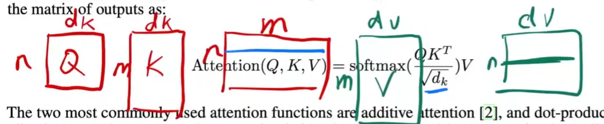
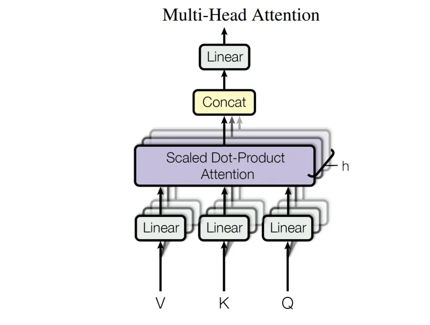
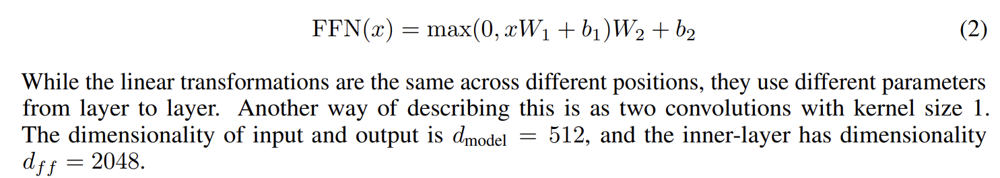
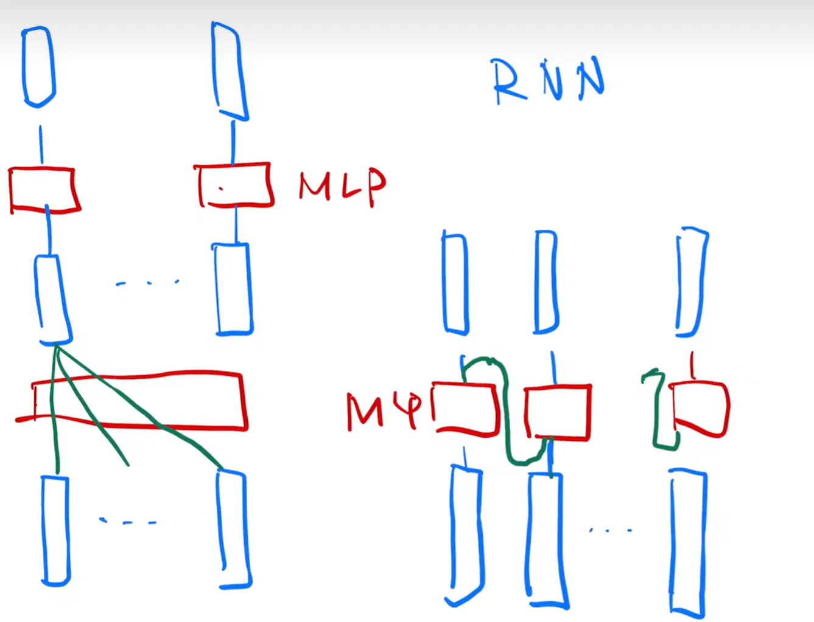
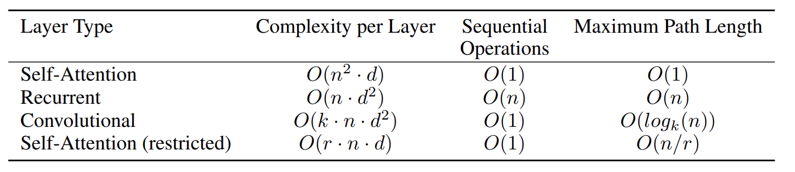
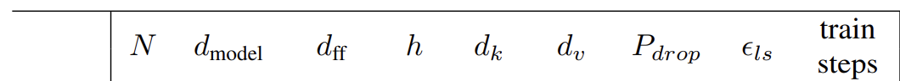

[Video Source](https://www.bilibili.com/video/BV1pu411o7BE/?spm_id_from=333.1387.top_right_bar_window_history.content.click&vd_source=83d7a54445de4810b52e58e4864b4605)

[Page Source](https://arxiv.org/pdf/1706.03762)

[Pratical Source](https://www.youtube.com/watch?v=kCc8FmEb1nY)

# 1. Introduction

<aside>

Extension of Abstract.

</aside>

## Sequence Modeling:

Recurrent language modelsExtension of Abstract.

- Operate step-by-step, processing one token or time step at a time.
- **one input + hidden state → one output + hidden state (update every time)**
- e.g., RNNs, LSTMs

Encoder-decoder architectures

- Composed of two RNNs (or other models):
    - one to encode input into a representation
    - another to decode it into the output sequence
- **one input + hidden state → … → hidden state → one output + hidden state → …**
- e.g., seq2seq

## Disadvantages about these two:

Recurrent models preclude parallelization, so it’s not good.

Encoder-decoder models have used attention to pass the stuff from encoder to decoder more effectively.

### Attention doesn’t use recurrence and entirely relies on an attention mechanism to draw glabal dependencies between input and output.

# 2. Background

<aside>

**Corresponding Work:**

Speak clearly about the corresponding papers, the connections between u and the papers, and the differences.

</aside>

### Reduce sequential computation:

Typically use **convolutional neural networks** → the number of operations grows in the distance between positions → **transfomer**: a constant number of operations

- at the cost of reduced effective resolution due to averaging attention-weighted positions
- we counteract this bad effect with Multi-Head Attention

## Self-attention:

compute a representation of the sequence based on different positions

## End-to-end memory networks:

✔ Reccurrence attention mechanism 

❌ Sequence-aligned recurrence

## Transformer:

The first **transduction** model relying entirely on self-attention to do encoder-decoder model. ( to compute representations of its input and output without using **sequence-aligned RNNs** or **convolution**)

---

**transduction model** refers to making predictions or inferences about specific instances based on the data at hand, without relying on a prior generalization across all possible examples, which is different from **Inductive learning**.

# 3. Model Architecture

The Transformer uses **stacked self-attention** and **point-wise**, **fully connected layers** for both the encoder and the decoder.

- **Encoder**: maps an input sequence of symbol representations x → a sequence of continuous representations z.
- **Decoder**: given z, generates an output sequence of symbols one element at a time. At each step, the model is **auto-regressive**.

### Why Using LayerNorm not BatchNorm?

**LayerNorm** normalizes across features of a single sample, suitable for **variable-length sequences**.

**BatchNorm** normalizes across the batch, which can be inconsistent for sequence tasks.

## 3.1 Encoder and Decoder Stacks

### Encoder

N = 6 identical layers, each layer has **two sub-layers**.

- multi-head self-attention mechanism
- simple, position-wise fully connected feed-forward network

For each sub-layer, connect **a layer normalization** and **a residual connection**. 

**dimension of output = 512**

### Decoder

N = 6 identical layers, each layer has **three sub-layers**.

- **masked multi-head attention over the output of the encoder stack**
- multi-head self-attention mechanism
- simple, position-wise fully connected feed-forward network

For each sub-layer, connect **a layer normalization** and **a residual connection**. 

## 3.2 Attention

An attention function can be described as mapping **a query** and **a set of key-value pairs** to an output where the query, keys, values, and output are all vectors.

The output is computed as **a weighted sum of the values**, where the weight assigned to each value is computed by a compatibility function of the **query** with the corresponding **key**.

( Given a query, output is computed by similarity between query and keys, then different keys have different weights, next combine the values based on the weights. )

### 3.2.1 Scaled Dot-Product Attention

We compute the **dot products of the query with all keys**, **divide each by length of query √**, and apply **a softmax function** to obtain the weights on the values.

<aside>

**Why divide each by length of query √ ?**

It prevents the input to the softmax from becoming excessively large, ensuring that the softmax outputs remain well-distributed and numerically stable.
The softmax function normalize the scores into probabilities, but it doesn't address the problem of large input magnitudes directly.
If the inputs to softmax are extremely large, the e^x can become numerically unstable,
leading to issues in computation.

</aside>

**n** refers to the length of a sequence, the number of the words.

**dk** refers to the length of the one word vector.

**m** refers to the number of the target words.

**dv** refers to the length of the one target word vector.

<aside>

**What there is a function of the Mask?**

When computing the output, I only use the key-value pairs up to the current time and do not use any later key-value pairs.

</aside>

### 3.2.2 Multi-Head Attention

**Linear projection**, just like lots of channels.

Linearly project the queries, keys and values h times to **low dimensions** with different, learned linear projections.

Finally, these are **concatenated** (stack) and once again projected.

We emply **h = 8** parallel **attention layers, or heads**. 

So for each layer or head, we make their dimension to **64** to make the total computational cost is similar to single-head attention.

### 3.2.3 Application of Attention in our Model

The Transformer uses multi-head attention in three different ways:

- In “encoder-decoder attention” layers,
    - **queries** → previous **decoder** layer
    - **keys and values** → the output of the **encoder**
- In “encoder self-attention” layers,
    - **keys, values** and **queries** all come from the previous layer in the **encoder**
- In “decoder self-attention” layers,
    - **keys, values** and **queries** all come from the previous layer in the **decoder**
    - allow each position in the decoder to attend to all positions in the decoder up to and including that position

## 3.3 Position-wise Feed-Forward Networks

The **fully connected** feed-forward network is applied to **each position** separately and identically.

The Multi-Head Attention has already get the location information, now we need to add more expression ability by **adding non-linear**.

<aside>

The output and **MLP patterns** are the same.
The difference are the **input source**.

</aside>

## 3.4 Embedding and Softmax

### Embedding

convert the input tokens to vectors of dimension ( 512 ), then **multiply those weights by** 

$\sqrt {d_{models}}$ 

<aside>

**Why multiply those weights by $\sqrt {d_{models}}$ ?**

To **boosts the magnitude**, making it more aligned with other components of the model. 
Because the initial value is between 0~1 by using normal distribution.

We update the L2 norm of the embeddings to 1 finally, so we need to ensure the value of each dimension not too small.
The L2 norm value of a vector to 1 is best to express a word, because it only express direction.

</aside>

### Softmax

convert the decoder output to predicted next-token probabilities.

## 3.5 Positional Encoding

**The order change, but the values don’t change.** So we **add the sequential information to the input.**

We use **sine and cosine functions** of different frequencies  **[-1, 1]**

# 4. Why Self-Attention

- **Length of a word → d**
- **Number of words → n**
- Self-Attention → **n words ✖️** every words need to multiply with **n words** and for each two words **do d multiplying**.
- Recurrent → **d-dimension vector** multiply **d✖️d matrix, n times**
- Convolutional → **k kernel_size, n words, d^2 input_channels ✖️ output_channels** (Draw picture clear)
- Self-Attention (restricted) → **r** the number of **neighbors**

**It seems like Self-Attention architecture has lots of advantages, but it needs more data and bigger model to train to achieve the same effect.**

# 5. Training

## 5.1 Training Data and Batching

Sentences were encoded using byte-pair encoding, which has a **shared source-target vocabulary of about 37000 tokens**. → So we **share the same weight matrix** between the two embedding layers and the pre-softmax linear transformation.

## 5.2 Hardware and Schedule

## 5.3 Optimizer

## 5.4 Regularization

- Residual Dropout
- Label Smoothing

# 6. Results

$N:$ number of blocks

$d_{model}:$  the length of a token vector

$d_{ff}:$ Feed-Forward Full-Connected Layer Intermediate layer output size

$h:$ the number of heads

$d_k:$ the dimension of keys in a head

$d_v :$ the dimension of values in a head

$P_{drop}:$ dropout rate

$\epsilon_{ls}:$ Label Smoothing value, the learned label value

$train steps:$ the number of batchs