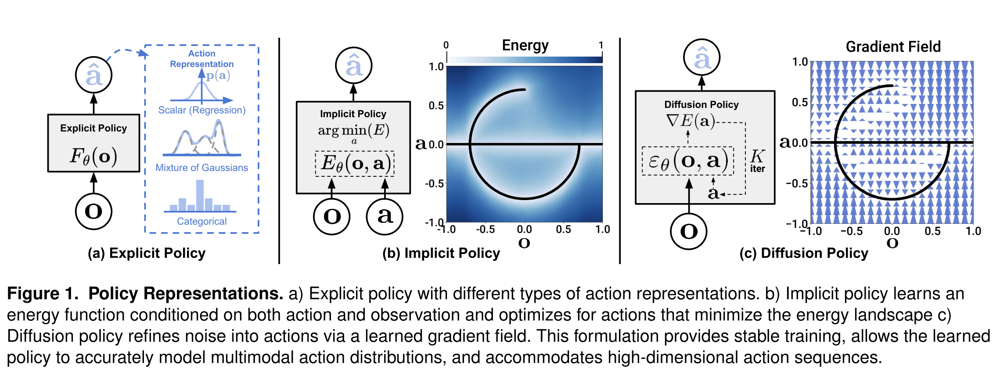

<aside>

A policy is any rule that maps observations/state to actions.

</aside>

# 1. Problems (what makes “BC = supervised learning” hard for robot actions)

## **1.1. Multimodal action distributions (one observation → many valid actions)**

In demonstrations, the same visual/state observation can reasonably lead to different next actions (e.g., go left vs right around an obstacle, different grasp styles, different sub-goal order). Explicit regressions (single Gaussian / MSE) tend to **average modes** and become “invalid” actions.

## **1.2. High-dimensional output and temporal consistency**

Robot control is sequential. Predicting **one step** at a time often produces tiny or mode-switching (action at t chooses mode A, action at t+1 chooses mode B). But predicting a **whole action sequence** is high-dimensional and hard for many policy classes.

## **1.3. Training instability of implicit / energy-based policies (IBC)**

Implicit policies (IBC) represent $p(a|o)\propto e^{-E(o,a)}$ but training needs **negative samples** to estimate the intractable normalization $Z(o,\theta)$, which can be inaccurate and causes instability and checkpoint sensitivity.

## **1.4. Real-world deployment constraints**

Policies must be **fast enough** for closed-loop control; naïve diffusion conditioning on both state and action trajectories can be expensive.

# 2. Method (how Diffusion Policy solves them)

<aside>

Core idea: policy = conditional denoising diffusion on action space

Train a model to predict the noise added to the expert action.

</aside>

Instead of outputting an action directly, the policy outputs a **denoising direction field** over actions and iteratively refines noise into an action sequence.

## **2.1. DDPM sampling view:**

Start from Gaussian noise $x^K$. For $k=K\to1$, update (x → x - predicted noise + noise):

$$
x^{k-1}=\alpha\Big(x^k-\gamma,\varepsilon_\theta(x^k,k)+\mathcal N(0,\sigma^2 I)\Big)
$$

where $\varepsilon_\theta$ is a learned “noise predictor” (can be seen as a learned gradient field). 

## 2.2. Adapt DDPM to visuomotor policy:

<aside>

generate **actions**, conditioned on **observations**

</aside>

The denoising update becomes:

$$
A_t^{k-1}=\alpha\Big(A_t^k-\gamma,\varepsilon_\theta(O_t, A_t^k, k)+\mathcal N(0,\sigma^2 I)\Big)
$$

So the network input is **(observation features, noisy action sequence, diffusion step k)** and output is **predicted noise / denoising direction** for that step.

## 2.3. Training:

<aside>

standard diffusion noise-prediction MSE (stable)

</aside>

Pick a clean expert action sequence $A_t^0$, sample a diffusion step $k$, add noise $\varepsilon_k$, train (actual noise added to the expert actions = predicted noise):

$$
L=\mathrm{MSE}\big(\varepsilon_k,\ \varepsilon_\theta(O_t,\ A_t^0+\varepsilon_k,\ k)\big)
$$

This avoids EBM’s intractable $Z(o,\theta)$ and negative sampling.

## 2.4. Key technical contributions to make it work well on robots

1. **Closed-loop action sequences + receding horizon control**
    
    At time $t$, use last $T_o$ observations $O_t$ to predict a **future horizon** of actions $T_p$, execute only $T_a$ steps, then re-plan (receding horizon). Warm-start the next plan for smoothness.
    
2. **Visual conditioning for speed**
    
    Treat vision as conditioning: compute visual features **once** and reuse them across diffusion iterations, enabling real-time inference.
    
3. **Time-series diffusion transformer**
    
    A transformer-based denoiser improves tasks requiring **high-frequency action changes / velocity control**, reducing over-smoothing seen in CNN temporal models.
    
    - The expert trajectory contains: move → stop → move quickly → stop
    - A CNN tends to produce: move → slow → slow → slow
4. **Real-time acceleration via DDIM**
    
    Use DDIM(Denoising Diffusion Implicit Models) to reduce latency (reported ~0.1s on RTX 3080 for real-world). Train with many diffusion steps (e.g., 100), but infer with fewer (e.g., 10–16) 
    

# 3. Novelty

<aside>

what’s new vs prior policy representations?

</aside>

## **3.1. New policy representation: “diffusion on action space”**

They frame a visuomotor policy as a **conditional denoising diffusion process over action sequences**, not direct regression (explicit) and not energy-minimization with negatives (EBM).

## **3.2. Handles multimodality naturally via stochastic sampling + iterative refinement**

Different random initializations $A_t^K$ and stochastic updates let the policy represent and sample **multiple valid action modes**, and action-sequence prediction helps it **commit to one mode per rollout**.

## **3.3. Scales to high-dimensional outputs by predicting action sequences**

Diffusion models are known to work in high dimension; they exploit this to model **whole trajectories**, improving temporal consistency and robustness (including idle-action segments).

## **3.4. Training stability advantage over IBC/EBM**

They explicitly explain stability: EBM needs $Z(o,\theta)$ and negative sampling; diffusion learns the **score** $\nabla_a \log p(a|o)$ which does **not** depend on $Z$, so training/inference avoid that source of instability.

## **3.5. System-level robotics contributions**

Receding-horizon execution, efficient visual conditioning(Extract observations once, then reuse them across all diffusion steps), and a time-series diffusion transformer are concrete robotics-driven changes that “unlock” diffusion for real-world visuomotor control.