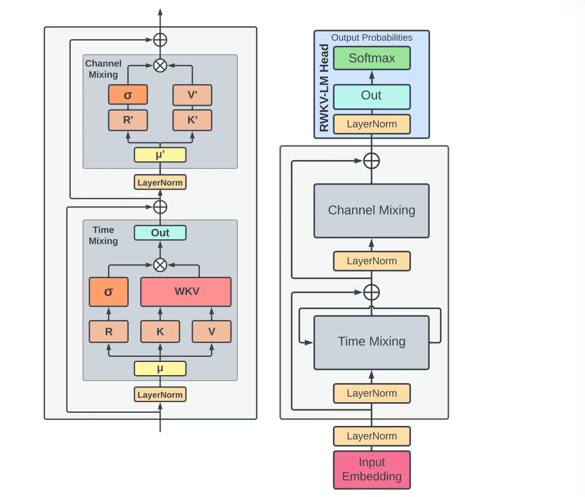

# Abstract

Transformers are very powerful for language tasks and training is ****faster on GPUs because of **parallization**, but they use **a lot of memory and computing power**, especially when processing long text, their cost grows **very fast** (quadratically).

RNNs, on the other hand, use **less memory and computation** cause they grow linearly but are **slower to train** and not as good at handling long sentences.

The new model **RWKV** mixes the good parts of both, it trains quickly and gets good performance like a Transformer and also runs efficiently like an RNN. 

<aside>

**Memory and computation:**

- In a Transformer, **each token looks at every other token** through *self-attention*. If you have **N tokens** in a sentence, it compares every pair, so total comparisons = **N × N = N².** That’s why **Memory** and **computation** both grow quadratically.
- In an RNN, the model reads tokens **one by one**, passing information step by step. So for **N tokens**, it just does **N steps**, the total cost = **N** (linear).
</aside>

# 1 Introduction

RWKV reformulates the attention mechanism with a variant of **linear attention**, replacing traditional **dot-product** token interaction with more effective **channel-directed attention**. This implementation, without approximation, offers the lowest computational and memory complexity.

# 2 Background

## 2.1 Recurrent Neural Networks (RNNs)

Popular RNN architectures such as **LSTM** and **GRU.** Although these RNNs can be factored into two **linear blocks** (W and U) and an RNN-specific block, the data dependency relying on previous time steps **prohibits parallelizing** these typical RNNs.

$$
\begin{aligned}
f_t &= \sigma_g\left(W_f x_t + U_f h_{t-1} + b_f\right), \\
i_t &= \sigma_g\left(W_i x_t + U_i h_{t-1} + b_i\right), \\
o_t &= \sigma_g\left(W_o x_t + U_o h_{t-1} + b_o\right), \\
\tilde{c}_t &= \sigma_c\left(W_c x_t + U_c h_{t-1} + b_c\right), \\
c_t &= f_t \odot c_{t-1} + i_t \odot \tilde{c}_t, \\
h_t &= o_t \odot \sigma_h(c_t).
\end{aligned}
$$

| Model | Depends on | Parallelizable? |
| --- | --- | --- |
| **RNN** | computed previous state | ❌ No |
| **RWKV** | raw previous input | ✅ Yes (for training) |

## 2.2 Transformers and AFT

### Standard Transformer self-attention

**Matrix form**

$$
\text{Attn}{Attn}(Q,K,V)=\text{softmax}(QK^\top)V
$$

**Per token (t)**

$$
\text{Attn}{Attn}(Q,K,V)_t=\frac{\sum_{i=1}^{T}\exp(q_t^\top k_i) \odot v_i}{\sum_{i=1}^{T}\exp(q_t^\top k_i)}
$$

- The **weighted value** equation in multi-head attention.
    - Weight of token $i$ for query $t$ is $\exp(q_t^\top k_i)$.
    - Output is a **weighted average** of $v_i$

### AFT (Attention-Free Transformer) variant

$$
\text{Attn}{Attn}^{+}(W,K,V)_t=\frac{\sum_{i=1}^{t}\exp(w_{t,i}+k_i)\odot v_i}{\sum_{i=1}^{t}\exp(w_{t,i}+k_i)}
$$

- Replace $q_t^\top k_i$ with **(learned) position bias** $w_{t,i}$ + a key score $k_i$.
- Causal: sum only $i\le t$.
- Still a normalized weighted average, but **weights depend on position** via $w_{t,i}$.

<aside>

Variables:

- **i**: past token index, what we’re reading from memory
- **t:** current token index, what we’re generating now
</aside>

### RWKV’s simplification

Define the bias as a **decay with distance**:

$$
w_{t,i}=-(t-i)w \qquad w\in(\mathbb{R}{\ge 0})^d
$$

- Per-channel vector $w$ ⇒ older tokens get weight $e^{-(t-i)w}\le 1$.
- Now weights depend only on **how far back** a token is, not on $q_t$.
- This structure lets us keep **running sums**, so we don’t need all pairwise scores.

**Result:**

**Same attention-like effect**, but computed with **O(T)** time and **O(1)** memory per step (like an RNN), while still trainable in parallel across tokens (like a Transformer) by prefix-scan tricks.

| Model | Has Query? | How it computes weights | Complexity | Key idea |
| --- | --- | --- | --- | --- |
| **Transformer** | ✅ Yes | all tokens attend to all | **O(N²)** | Full pairwise attention, strong but heavy |
| **AFT** | ❌ No | Uses **position bias** | **O(N)** | Removes query, uses learned positional weights |
| **RWKV** | ❌ No | Adds **time-decay weights**  | **O(N)** | AFT idea + RNN-style update (linear, efficient) |

# 3 RWKV

Four fundamental elements:

- **R**: The Receptance vector acts as the receiver of past information.
- **W**: The Weight signifies the **positional weight decay** vector, a trainable parameter within the model.
- **K**: The Key vector performs a role analogous to K in traditional attention mechanisms.
- **V**: The Value vector functions similarly to V in conventional attention processes.

<aside>

The difference between **Time Mix** and **Channel Mix**:

- **Time Mix:**  Builds each token’s vector using **time order** and **previous token info**
- **Channel Mix:** Refines each token’s vector by **mixing internal dimensions** (features). It processes **each token separately** to mix and refine its feature channels.

</aside>

## 3.1 Architecture

The RWKV model is composed of **stacked residual blocks**. Each block consists of a **time-mixing** and a **channel-mixing** sub-block, embodying recurrent structures to leverage past information.

This model uses a unique **attention-like score update process**, which includes a time-dependent **softmax** operation improving numerical stability and mitigating vanishing gradients. It ensures that the gradient is propagated along the **most relevant path**. Additionally, layer normalization incorporated within the architecture aids in stabilizing the gradients, effectively addressing both vanishing and exploding gradient issues.

### 3.1.1 Token Shift

In this architecture, all **linear projection vectors** (R, K, V in time-mixing, and R′, K′ in channel-
mixing) involved in computations are produced by **linear interpolation** between current and previous timestep inputs, facilitating **a token shift**. 

The vectors for time-mixing computation are linear projections of linear combinations of the current and previous inputs of the block:

$$
\begin{aligned}
r_t &= W_r \cdot \left(\mu_r \odot x_t + (1 - \mu_r) \odot x_{t-1}\right), \\
k_t &= W_k \cdot \left(\mu_k \odot x_t + (1 - \mu_k) \odot x_{t-1}\right), \\
v_t &= W_v \cdot \left(\mu_v \odot x_t + (1 - \mu_v) \odot x_{t-1}\right).
\end{aligned}
$$

The channel-mixing inputs:

$$
\begin{aligned}
r'_t &= W'_{r} \cdot \left(\mu'_{r} \odot x_t + (1 - \mu'_{r}) \odot x_{t-1}\right), \\
k'_t &= W'_{k} \cdot \left(\mu'_{k} \odot x_t + (1 - \mu'_{k}) \odot x_{t-1}\right).
\end{aligned}
$$

### 3.1.2 WKV Operator

$$
wkv_t = \frac{\sum_{i=1}^{t-1} e^{-(t-1-i)w + k_i} \odot v_i + e^{u + k_t} \odot v_t}{\sum_{i=1}^{t-1} e^{-(t-1-i)w + k_i} + e^{u + k_t}}
$$

<aside>

The difference of treating **W** between **AFT** and **RWKV**:

- **Pairwise matrix:** Each token pair has its own weight
- **Channel-wise vector:** One decay weight per feature channel
</aside>

### 3.1.3 Output Gating

**Time Mixing:**

$$
o_t = W_o \cdot (\sigma(r_t) \odot wkv_t)
$$

**Channel Mixing:**

$$
o'_t = \sigma(r'_t) \odot (W'_v \cdot \max(k'_t, 0)^2)
$$

# 4 Trained Models and Computing Costs

Adam optimizer, bfloat16 precision, the auxiliary loss introduced by PaLM…

## 4.2 Scaling Laws

Scaling laws in language models refer to the **mathematical relationships** that describe how the **performance** of a language model **changes** with respect to **various factors**.

Scaling laws are important for two primary reasons: 

1. they allow us to make predictions and plans regarding the **costs and performance** of large models before they are trained via interpolation and extrapolation.
2. the contexts in which they fail provides rich feedback on important areas for future research.

<aside>

Explain **Interpolation** and **Extrapolation:**

- **Interpolation:** **predicting within** the range of data you already know. For example, you trained models with 1B, 5B, and 10B parameters, then you **interpolate** to guess how a 7B model will perform.
- **Extrapolation: predicting beyond** the known range. For example, you trained up to 10B, and now you try to **estimate** performance of a 100B model.
</aside>

# 5 Evaluation

**Evaluation direction and questions:** 

- **Competitiveness:** Tests if **RWKV** performs as well as **Transformers** when both use the **same computing power**.
- **Long Context:** Tests if **RWKV** can handle **very long texts** better than Transformers,
    
    especially when Transformers become **too slow or costly** for long sequences.
    

# 6 Inference Experiments

float32 precision, the HuggingFace Transformers, 

# 7 Future Work

**1. Increase Model Expressivity**

- Improve time-decay formulas.
- Explore better initialization of model states.
- Goal: more powerful representations without losing efficiency.

**2. Improve Computational Efficiency**

- Use **parallel scan** in $wkv_t$  step.
- Target complexity: $O(B \log(T)d)$.

**3. Apply to Encoder–Decoder Architectures**

- Replace cross-attention with RWKV mechanism.
- Useful for **seq2seq** and **multimodal** models.
- Boosts efficiency in both training and inference.

**4. Use of Model State (Context)**

- Used for interpretability and predictability.
- Could enhance safety and control via **prompt tuning**.
- Modify hidden states to guide model behavior.

**5. Larger Internal States**

- Improve long-term memory and context understanding.
- Increase performance across various tasks.

# 8 Conclusion

We introduced **RWKV**, a new approach to RNN models exploiting the potential of time-based mixing components. RWKV introduces several key strategies that allow it to capture locality and long-range dependencies while addressing limitations of current architectures by: (1) replacing the quadratic QK attention with **a scalar formulation at linear cost**, (2) reformulating recurrence and sequential inductive biases to enable efficient **training parallelization and efficient inference**, and (3) enhancing training dynamics using **custom initializations**.

We benchmark the proposed architecture in a wide variety of NLP tasks and show comparable performance to **SoTA** with reduced cost. Further experiments on expressivity, interpretability, and
scaling showcase the model capabilities and draw parallels in behavior between RWKV and other
LLMs.

RWKV opens a new route for **scalable and efficient architectures** to model complex relationships in **sequential data**. While many alternatives to Transformers have been proposed with similar claims, ours is the first to back up those claims with pretrained models with tens of billions of parameters.

# 9 Limitations

**1. Performance Limitation (Memory Loss over Long Contexts)**

- Linear attention is efficient but may **lose fine details** over long sequences.
- RWKV compresses history into a **single vector**, unlike Transformers that keep all token interactions.
- Its **recurrent design** limits ability to fully “look back” at distant tokens.

**2. Dependence on Prompt Engineering**

- RWKV relies more on **well-designed prompts** than Transformers.
- Poor prompts may cause information loss between prompt and continuation.