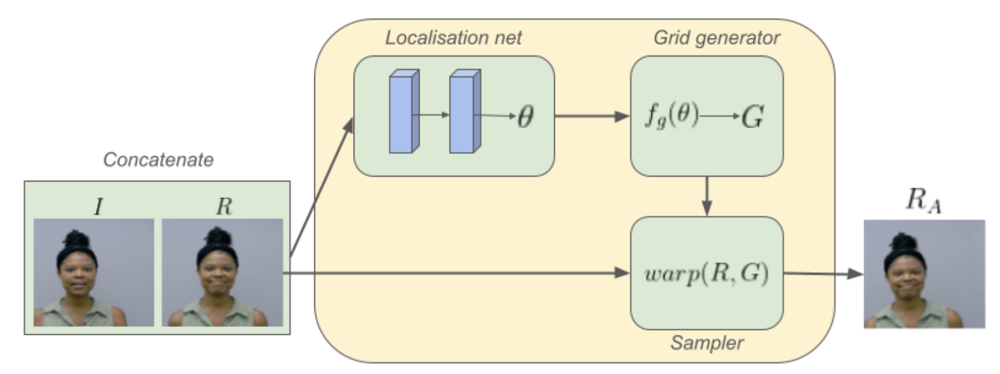

Source code: [https://github.com/varun-jois/FSRST](https://github.com/varun-jois/FSRST)

### **Introduction**

Face super-resolution aims to reconstruct high-resolution (HR) facial images from low-resolution (LR) inputs, enhancing **fine details**. This task is challenging because it is **ill-posed**: many possible HR outputs can correspond to the same LR image.

To reduce ambiguity, **Reference-Based Super-Resolution (RefSR)** introduces external HR reference images that share similar content (e.g., same person’s other photos). The model can then use these reference textures and shapes to guide reconstruction.

However, RefSR introduces two main challenges:

1. **Alignment problem** – matching facial structures between LR input and HR reference images.
2. **Information aggregation problem** – determining how much and which parts of each reference to use.

Traditional alignment methods (like deformable convolutions) are powerful but unstable and hard to train. To overcome this, the authors propose **FSRST**, which uses a **Spatial Transformer Network (STN)** for stable alignment and a **distance-based weighted aggregation** for effective information fusion.

### **Method**

The proposed **Face Super-Resolution using Spatial Transformer (FSRST)** is an end-to-end model with four components:

1. **Feature Extractor:**
    
    Extracts features from both the LR input and HR references using residual blocks. Reference images are converted to grayscale and reshaped (space-to-depth) to match the LR resolution.
    
2. **Spatial Transformer Alignment (STA):**
    
    Replaces unstable deformable convolutions with a **Spatial Transformer module**. It predicts an affine transformation that aligns each reference’s features with those of the LR image. This alignment is differentiable and stable, ensuring good correspondence between LR and HR feature spaces.
    
    
    
3. **Distance-Based Weighted Aggregation (DWA):**
    
    After alignment, the model computes the L2-distance between each aligned reference feature and the LR feature. A **softmax weighting** gives higher importance to more similar references, while irrelevant ones are ignored. This allows the model to dynamically use helpful references or fall back to single-image SR when references are poor.
    
4. **Output Constructor:**
    
    Combines aggregated and LR features and passes them through multiple residual blocks and sub-pixel convolution for upsampling. The model predicts a **residual image**, added to a bicubic-upsampled LR image to produce the final HR output.
    

# **Conclusion**

The FSRST model introduces a **stable and efficient alternative** to deformable alignment for reference-based face super-resolution.

Its **Spatial Transformer alignment** provides consistent and accurate correspondence, while the **distance-based aggregation** flexibly handles multiple references.

Experiments on **DFD**, **CelebAMask-HQ**, and **VoxCeleb2** datasets show that FSRST outperforms previous methods like TTSR, C2-Matching, MRefSR, and HIME — achieving higher PSNR/SSIM with fewer parameters.

Although the STN-based alignment is not fully convolutional (fixed input size), the method is lightweight, effective, and adaptable for real-time applications such as video conferencing.

Future work aims to extend this model to **video super-resolution** and make the alignment module fully convolutional.