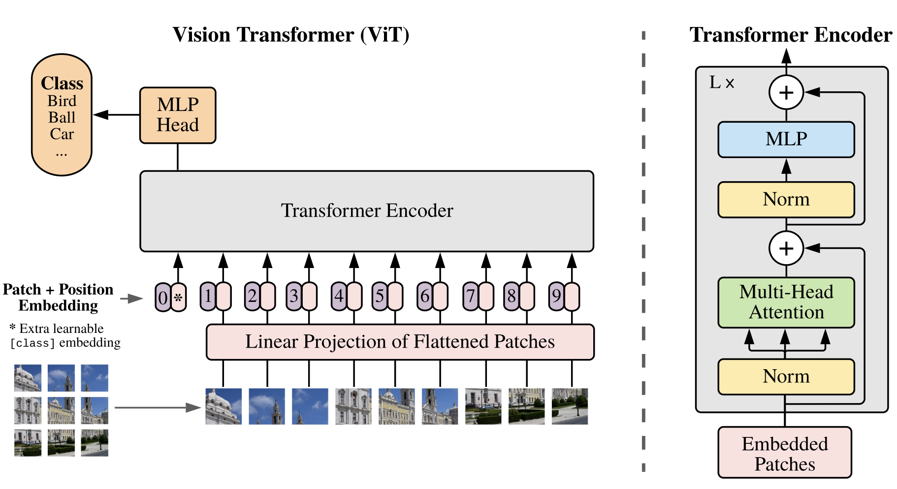

# Introduction

Self-attention-based architectures, especially **Transformers**, have become the first choice of model in **natural language processing (NLP)**. The main approach is to **pre-train** on a large text corpus and then **fine-tune** on a smaller task-specific dataset. Thanks to Transformers’ computational efficiency and scalability, it has become possible to train models of record-breaking size, with over 100B parameters. With the models and datasets growing, there is still no sign of reaching a performance limit .

However, **convolutional architectures** remain dominant in computer vision. Inspired by the success of Transformers in NLP, many studies have attempted to **integrate self-attention mechanisms into CNN-like architectures**. A naïve application of self-attention to images would require each pixel to attend to every other pixel, resulting in quadratic computational cost with respect to the number of pixels, which does not scale to realistic image sizes. Later works introduced techniques such as local, sparse, or block attention, or reduced image resolution to reduce this cost. Although these methods make self-attention more scalable for visual data, they often demand complex engineering for efficient implementation on GPUs or TPUs, and are not well-suited for large-scale datasets. Consequently, in large-scale image recognition, classical convolutional architectures such as ResNet still dominate the state of the art.

Here, a new approach **ViT** is introduced that **applies a standard Transformer directly to images with minimal modifications**. To achieve this, the image is divided into **patches**, and a sequence of linear embeddings of these patches is fed into the Transformer. Each image patch is treated the same way as a token (word) in NLP applications. The model is trained for image classification in supervised learning. When trained on mid-sized datasets such as ImageNet without strong regularization, the performance is moderate; however, the picture changes dramatically when the model is trained on large-scale datasets containing 14M–300M images. In such cases, large-scale training outweighs the need for strong inductive biases. The **Vision Transformer (ViT)** achieves excellent results when pre-trained at sufficient scale and then fine-tuned on downstream tasks with fewer data points.

# Methods

The design of the model follows the original Transformer as closely as possible. An advantage of this intentionally simple setup is that scalable NLP Transformer architectures, and their efficient implementations which can be used almost out of the box.

## Vision Transformer (ViT)

In its input stage, an image $\mathbf{x} \in R^{H \times W \times C}$ with height H, width W, and C channels is divided into small, non-overlapping patches of size $(P, P)$. Each patch is flattened into a vector, resulting in a sequence of patch vectors $\mathbf{x}_p \in R^{N \times (P^2 \cdot C)}$, where $N = \frac{H W}{P^2}$ represents the total number of patches (also the effective sequence length for the Transformer). These flattened patch vectors are then linearly projected into a latent feature space of dimension $D$ using a trainable weight matrix. The output of this projection forms the **patch embeddings**, which serve as the Transformer’s token representations, the same as the word embeddings in NLP models.

Similar to BERT, ViT introduces an additional learnable **[class] token** that is placed in the beginning of the sequence of patch embeddings. Its output vector, after passing through all Transformer layers, represents the entire image and is used for classification. The model attaches a **classification head** to this [class] token output, which is implemented as a multilayer perceptron (**MLP**) with one hidden layer during pre-training and a single **linear layer** during fine-tuning.

$$
output=softmax(Head([class] token))
$$

### **Positional Encoding**

Because the Transformer itself has no spatial concept, ViT adds **positional embeddings** to the patch embeddings to retain information about the patches’ relative locations. The authors use simple, learnable **1D positional embeddings** instead of more complex 2D-aware ones, as they found little improvement from the latter. 

### **Transformer Encoder**

The resulting sequence (**class token** + **patch embeddings** + **positional embeddings**) is then fed into a standard Transformer encoder identical to that used in NLP. Each encoder block alternates between **multi-head self-attention (MSA)** and **feed-forward MLP** sublayers, with **layer normalization (LN)** and **residual connections** applied around both.

The key computation within one layer of the model can be summarized by the following equations:

$$
\begin{aligned}
z_0 &= [\,x_{class};\; x_p^1 E;\; \ldots;\; x_p^{N} E\,] + E_{pos}, \quad E \in R^{(P^2 \cdot C) \times D}, \quad E_{pos} \in R^{(N+1) \times D} \\
z'_{\ell} &= MSA(LN(z_{\ell-1})) + z_{\ell-1}, \quad \ell = 1, \ldots,L \\
z_{\ell} &= MLP(LN(z'_{\ell})) + z'_{\ell}, \quad \ell = 1, \ldots,L \\
y &= LN(z^{0}_{L})
\end{aligned}
$$

| Symbol | Meaning |
| --- | --- |
| **P** | Patch size |
| **C** | Number of color channels |
| **N** | Number of patches |
| **D** | Embedding dimension |
- $x_p^i \in R^{P^2 \cdot C}$ is the **flattened vector of the i-th image patch**.
- $E \in R^{(P^2 \cdot C) \times D}$ is the **linear projection matrix** for patch embeddings.
- $E_{\text{pos}} \in R^{(N+1) \times D}$ provides **positional embeddings** for all tokens, including the class token.
- $\text{MSA}$ denotes the **multi-head self-attention** mechanism that models global dependencies across all patches. **Self-attention** computes: $\text{Attention}(Q,K,V) = \text{softmax}\left(\frac{QK^T}{\sqrt{d_k}}\right)V$
- $\text{MLP}$ is a two-layer feed-forward network with a GELU (Gaussian Error Linear Unit) activation function **to each patch token separately**, adding non-linearity. There’s **no cross-patch connection**. The input and output dimensions are the same $D$.
- The residual connections (“+” terms) help preserve gradients and stabilize training.
- Final $LN(z_L^0)$ applied after all Transformer layers (not shown in block diagram).

Together, these operations define one forward pass through the ViT encoder, where $L$ is the total number of Transformer layers.

### **Inductive Bias**

A defining characteristic of the Vision Transformer is that it possesses **much weaker image-specific inductive bias** than convolutional neural networks (CNNs). In CNNs, design principles such as **local connectivity**, **two-dimensional neighborhood structure**, and **translation equivariance** are built into the convolution operation at every layer. These biases make CNNs naturally suited for visual data. 

**ViT**, in contrast, uses **global self-attention**, allowing every image patch to communicate with **all other patches** at once. This means ViT does **not** have any built-in understanding of local areas or spatial hierarchy — the model itself doesn’t “know” which patches are next to each other. Inside ViT, only the small **MLP layers** work separately on each patch (they don’t mix information between patches). The **positional embeddings** just tell the model roughly where each patch is in the image, but they don’t teach it how nearby regions are related. As a result, ViT must **learn all spatial relationships by itself** from the training data, instead of having them designed into the architecture like CNNs do. Therefore, ViT depends heavily on **large-scale training data** to learn these spatial patterns effectively.

### **Hybrid Architecture**

The authors also explore a **hybrid architecture** that combines the strengths of CNNs and Transformers. Instead of feeding the Transformer with raw image patches, they use **CNN feature maps** as input. In this case, each patch corresponds to a small region (for example, 1×1) of the CNN’s feature map. The later steps are the same. This hybrid approach introduces some of the beneficial inductive biases of CNNs (such as local feature extraction) while maintaining the global modeling capacity and scalability of the Transformer.

## Fine-tuning and Higher Resolution

During training, the Vision Transformer is first **pre-trained on a large dataset** and later **fine-tuned** on a smaller, task-specific dataset. When fine-tuning, the authors **remove the old classification head** (used in pre-training) and **replace it** with a new one that matches the number of classes in the new task.

Sometimes, it helps to **fine-tune using higher-resolution images** than were used during pre-training. In that case, the **patch size** stays the same, so the model now receives **more patches** (a longer input sequence). However, the **position embeddings** learned during pre-training may no longer align with the new number of patches. To fix this, the authors **resize the position embeddings matrix** in 2D so that they fit the new image resolution.

This **resolution adjustment** and **patch extraction** are the only points at which an inductive bias about the **2D structure of the images** is manually injected into the Vision Transformer.

# Experiments

The authors compare Vision Transformer (ViT) with ResNet and hybrid CNN–Transformer models to evaluate its representation learning ability. Models are pre-trained on large datasets, **ImageNet (1.3M images)**, **ImageNet-21k (14M images)**, and **JFT-300M (303M images),** and then fine-tuned on smaller benchmarks such as **CIFAR-10/100**, **Oxford Pets**, **Oxford Flowers-102**, and the **VTAB** suite.

Three ViT variants are tested: **Base (86M params)**, **Large (307M)**, and **Huge (632M)**, corresponding to 12, 24, and 32 Transformer layers. **Smaller patch sizes give better resolution but higher computational cost.** Models are trained with the **Adam** optimizer, large batch size, and linear learning-rate warm-up, and fine-tuned at higher image resolutions for better results.

When pre-trained on **JFT-300M**, ViT-H/14 and ViT-L/16 outperform both **Big Transfer (BiT)** ResNets and Noisy Student EfficientNet models on nearly all datasets while using less computation. Even with public ImageNet-21k pre-training, ViT achieves competitive accuracy.

A key result is that **dataset size is critical**: ViT underperforms ResNets on small data (ImageNet-1k) but surpasses them as the dataset grows. Larger ViT models continue to improve with more data, while ResNets **plateau**. Hybrid CNN–Transformer models help for smaller data but offer no advantage at large scale. 

<aside>

In **few-shot evaluation**, the Vision Transformer is not fully retrained. Instead, its pre-trained features are frozen, and only a simple linear classifier is trained on top of them using **a very small number of labeled examples per class**, such as 5 images for each category in ImageNet. This setup tests how well the model’s learned representations can generalize to new tasks when only a few labeled samples are available, showing the quality and transferability of the pre-trained features.

</aside>

Also, the authors explore **self-supervised pre-training** for Vision Transformers, inspired by how Transformers in NLP achieve strong results through large-scale **self-supervised learning** rather than supervision alone. They experiment with a **masked patch prediction** task, similar to BERT’s masked language modeling, where parts of an image are hidden and the model learns to predict them. Using this method, the smaller ViT-B/16 model reaches 79.9% accuracy on ImageNet, which is **2% better than training from scratch** but still **4% lower than supervised pre-training**. The authors note that while self-supervision improves performance, it does not yet match large-scale supervised results. They suggest that exploring **contrastive pre-training methods** could be a promising direction for future research.

# Conclusion

**ViT** is the direct application of Transformers to image recognition. Unlike prior works using self-attention in computer vision, it do not introduce image-specific **inductive biases** into the architecture apart from the initial patch extraction step. Instead, it interpret an image as a
sequence of patches and process it by a standard Transformer encoder as used in NLP. This simple, yet scalable, strategy works surprisingly well when coupled with **pre-training on large datasets**. Thus, ViT matches or exceeds the sota on many image classification datasets, meantime being relatively cheap to pre-train. 

While these initial results are encouraging, many challenges remain. One is to apply ViT to other computer vision tasks, such as detection and segmentation. Another challenge is to continue exploring **self-supervised** pre-training methods. The initial experiments show improvement from self-supervised pre-training, but there is still **large gap between self-supervised and large-scale supervised pre-training**. Finally, further scaling of ViT would likely lead to improved performance.