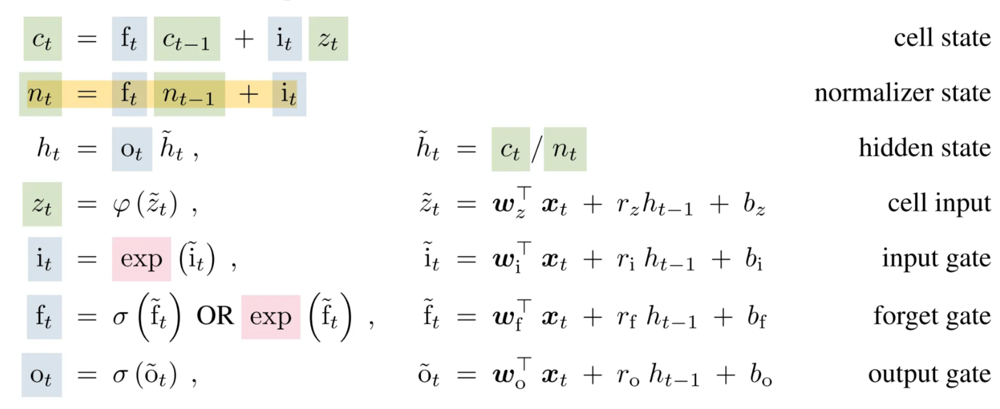
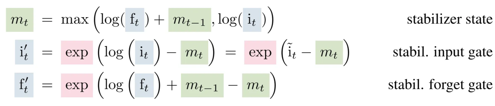
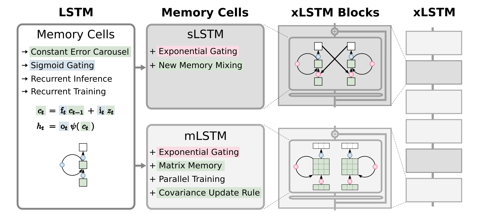

[paper resource](https://arxiv.org/abs/2405.04517)

<aside>

- **RWKV** = a *bridge* between LSTM and Transformer (less computation and memory, parallel in training). Replace self-attention with a time-mixing mechanism that behaves like an LSTM in time but a Transformer in training and inference
- **xLSTM** = s*cale up* the LSTM family to match or even surpass Transformer-level performance. Keep the recurrent spirit of LSTM, but redesign gates and memory (mLSTM) so it can train and scale efficiently like Transformers.
    - Speciality: memory mixing, ~~RWKV~~
</aside>

# Abstract

The paper revisits **LSTMs**, whose key innovations are the **constant error carousel** and **gating mechanisms** — originally solved the vanishing-gradient problem and made long-term memory possible. Although **Transformers** later surpassed LSTMs thanks to their **parallelizable self-attention**, the authors ask whether LSTMs can be scaled up, like modern LLMs, to **billions of parameters** while overcoming their known limits.

To achieve this, they introduce:

1. **Exponential gating** — a new gating function with improved normalization and stability.
2. **Modified memory structures:**
    - **sLSTM** — uses **scalar memory** and **scalar updates** with new “memory mixing.” **→** **memory mixing**
    - **mLSTM** — introduces **matrix-based memory** that supports full parallelization and a **covariance-based update** rule. A new memory architecture **→ parallelization**

By stacking these enhanced cells into **residual xLSTM blocks**, they create architectures that combine the strengths of LSTMs and Transformers.

Experiments show that **xLSTMs** can match or even outperform **Transformers** and **State Space Models** in both **performance and scaling**. 

👉 **Code:** [github.com/NX-AI/xlstm](https://github.com/NX-AI/xlstm)

# 1 Introduction

## 1.1 LSTM

$$
c_t = f_t  c_{t-1} + i_t  z_t, \quad h_t = o_t  \psi(c_t)
$$

---

1. **Update the cell state / long-term memory:**

$$
c_t = f_t  c_{t-1} + i_t  z_t
$$

- $c_t$: **Cell state,** real-valued vector, the internal **long-term memory** after update
- $f_t$: **Forget gate,** values in (0, 1), **decide how much of $c_{t-1}$ to keep**
- $c_{t-1}$: **Previous cell state**, vector, carries long-term memory
- $i_t$: **Input gate,** values in (0, 1), **decides how much new info to write**
- $z_t$: **Cell input / candidate memory,** usually $\tanh(\cdot)$ output, the *new content* that could be added

---

1. **Produce the output / hidden state / short-term memory:**

$$
\quad h_t = o_t  \psi(c_t)
$$

- $h_t$: **Hidden state,** vector, output of the cell (**short-term memory**)
- $o_t$: **Output gate,** values in (0, 1), controls what part of memory is shown outside
- $\psi(c_t)$: Activation function (often $\tanh(c_t$)), squashes memory to bounded range

---

### Three Main Limitations of LSTMs

1. **Can’t revise stored information**
    - Once an LSTM stores something in its cell state, it struggles to *update or replace* it later.
    - **xLSTM fix:** introduces **exponential gating**, allowing flexible updating of stored values.
2. **Limited storage capacity**
    - Traditional LSTMs store information in a **single scalar cell state**, forcing compression and loss of details.
    - **xLSTM fix:** uses a **matrix memory**, which can hold richer, multi-dimensional information.
3. **No parallelization**
    - LSTM depends on **sequential hidden-to-hidden connections**, meaning each step waits for the previous one.
    - **xLSTM fix:** changes the memory mixing structure to make computation **parallelizable** across time steps.

# 2 Extended LSTM

- Two main modifications: **exponential gating** and **novel memory structures**.
- Two variants mombined into **xLSTM blocks**, stacked with **residual connections** to build xLSTM architectures, both can have **multiple memory cells and heads**:
    - **sLSTM** – scalar memory, scalar update, **memory mixing across cells**.
    - **mLSTM** – matrix memory, covariance (outer product) update, **fully parallelizable**.

## 2.2 sLSTM

sLSTM = LSTM + **exponential gates** + **normalization state** + **stabilizer state** + m**ultiple memory cells**.

- The **exponential gates $i_t$** and $f_t$ make it easier to *amplify or reduce* memory dynamically.
    
    → Helps sLSTM revise stored information better (a key limitation of classical LSTM).
    
- The **normalizer state $n_t$** keeps things numerically stable, so exponential growth doesn’t blow up.
- The **stabilizer state $m_t$** keeps their scale controlled, **prevents numerical overflow** during training.
- The **Multiple heads** each with its own LSTM-like structure to compute its own $h_t$, then combined, just like multi-head attention in Transformers, allowing the network to learn different kinds of temporal patterns in parallel.

<aside>

**New Memory Mixing:** In an **sLSTM**, each time step has **multiple memory cells → a vector** computed by recurrent matrices R, each cell stores part of the long-term memory, we allow **these memory cells to talk to each other.**

**Memory mixing** = different parts (dimensions) of the memory cells communicate and influence each other.

</aside>

## 2.3 mLSTM

mLSTM = LSTM + **exponential gates** + **normalization state** + **stabilizer state** + **multiple memory cells**.

**mLSTM** replaces the small one-number memory $c_t$ of LSTM with a **key–value memory matrix**, so it can *store*, *search*, and *update* information like **attention**, but still works as a **recurrent network** (RNN).

- $q_k, k_t, v_t$ → same like query, key, value in transformer…
- **uses a matrix memory** because it wants to **store relationships** between features (keys and values), not just single values like traditional LSTM.
- The **normalizer state $n_t$** is the weighted sum of key vectors, keeps record of the strength of the gates.
- Multiple heads and multiple cells are equivalent as there is **no memory mixing**.

## 2.4 xLSTM Architecture

### 2.4.1 xLSTM Blocks

Each block takes an input (sequence or features), passes it through an **sLSTM** or **mLSTM** cell, adds some **non-linear layers (MLPs)** and **residual/skip connections**, finally outputs a transformed sequence representation.

<aside>

**Patterns are easier to separate after mapping into a higher-dimensional space.** Like for better points classification, we can map each point from 2D → 3D.

When an xLSTM processes a sequence, it wants to **distinguish different histories,** for example:

- “The dog chased the cat” vs “The cat chased the dog.”

These sequences may look similar in lower dimensions (both use same words), but when we map them into a **higher-dimensional representation**, the model can more easily tell them apart.

So each **xLSTM block**:

- expands data into a higher space (“up-projection”),
- applies non-linear transformations,
- and then compresses back (“down-projection”).

That makes it easier for the model to **separate different contexts or meanings**.

</aside>

---

|  | Type | Memory type | Recurrent connections | Parallelization | Up-proj position | Storage capacity |
| --- | --- | --- | --- | --- | --- | --- |
| sLSTM | **Post up-projection** | Scalar memory (vector) | ✅ via matrices R | ❌ Sequential | after LSTM | Smaller |
| mLSTM | **Pre up-projection** | Matrix memory | ❌ No recurrent matrices | ✅ parallelizable | before LSTM | Much larger |

### 2.4.2 xLSTM Architecture

<aside>

Figure 1: **The extended LSTM (xLSTM) family.** 

From left to right: 

1. The original LSTM memory cell with constant error carousel and gating. 
2. New sLSTM and mLSTM memory cells that introduce exponential gating. **sLSTM** offers a new memory mixing technique. **mLSTM** is fully parallelizable with a novel matrix memory cell state and new covariance update rule. 
3. mLSTM and sLSTM in residual blocks yield **xLSTM blocks**. 
4. Stacked xLSTM blocks give an **xLSTM architecture**.
</aside>

The **constant error carousel** is the **additive update** of the cell state $c_{t−1}$ (green) by cell inputs $z_t$ and moderated by sigmoid gates (blue).

The gating mechanisms:

- **Forget gate** decides what to erase.
- **Input gate** decides what to add.
- **Output gate** decides what to show.

# 4 Experiments

LSTM and xLSTM models **far outperform Transformers and State Space Models** on tasks that need **long-term memory and state tracking; xLSTM**, especially when combining sLSTM + mLSTM, achieves the **best all-around performance**, showing that **recurrent memory architectures** still beat attention models for logical and structured reasoning.

---

<aside>

The paper uses **perplexity (ppl)** as the main evaluation metric for language modeling. It measures **how well the model predicts the next token** in a text sequence.

- The model is confident and accurate → the model gives **high probability** to the correct next word → it’s confident → **low perplexity**.
- The model is confused and often wrong → the model gives **low probability** → it’s uncertain or wrong → **high perplexity**.
</aside>

## Scaling Laws

Next token prediction perplexity of xLSTM, RWKV-4, Llama, and Mamba on the SlimPajama validation set when trained on 300B tokens from SlimPajama. Model sizes are 125M, 350M, 760M, and 1.3B. The scaling laws indicate that for larger models xLSTM will perform well too.

# 5 Limitations

1. **sLSTM not parallelizable:**
    - Its memory mixing prevents full parallel execution.
    - Custom CUDA version is faster, but still ~2× slower than mLSTM.
2. **mLSTM kernels not optimized:**
    - Current CUDA implementation is ~4× slower than FlashAttention.
    - Could be improved with better GPU kernels.
3. **High computation cost:**
    - mLSTM processes (d \times d) matrices, which increases compute load,
        
        though it can still be parallelized using standard matrix ops.
        
4. **Gate initialization sensitivity:**
    - Forget-gate parameters must be tuned carefully for stability.
5. **Memory limits at long contexts:**
    - Large matrix memory may overload at very long sequence lengths,
        
        but works fine up to ~16k tokens.
        
6. **Not fully optimized yet:**
    - Architecture and hyperparameters weren’t exhaustively tuned due to cost.
    - More optimization could further boost performance.