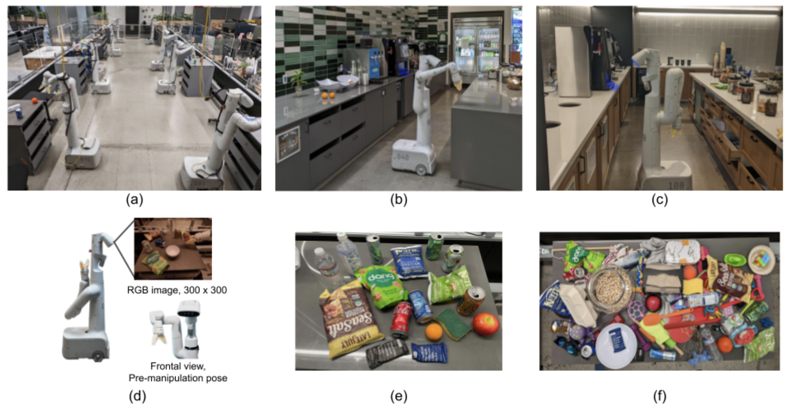
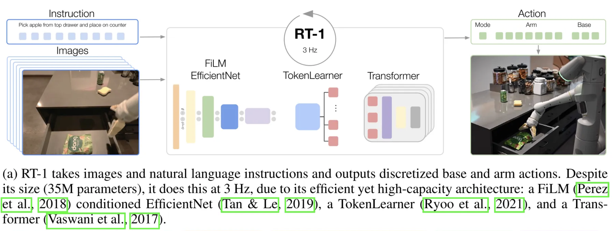
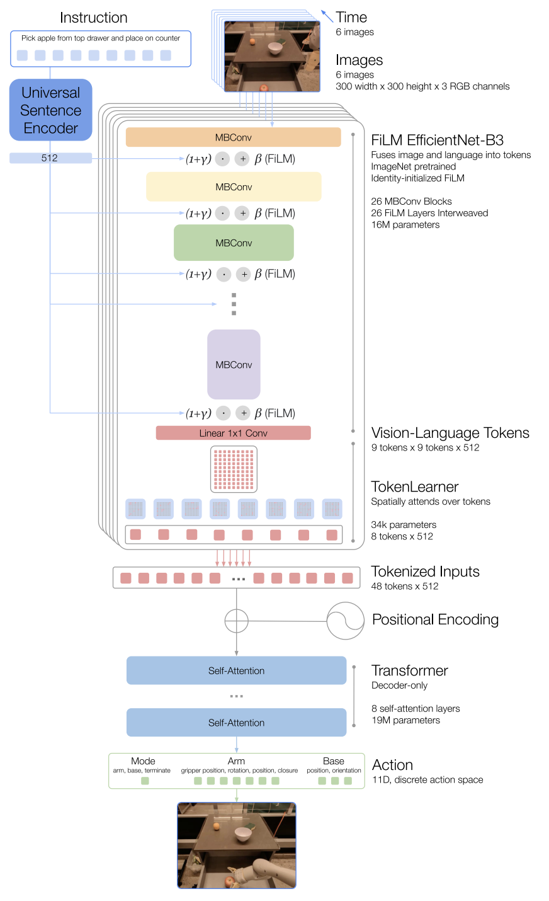
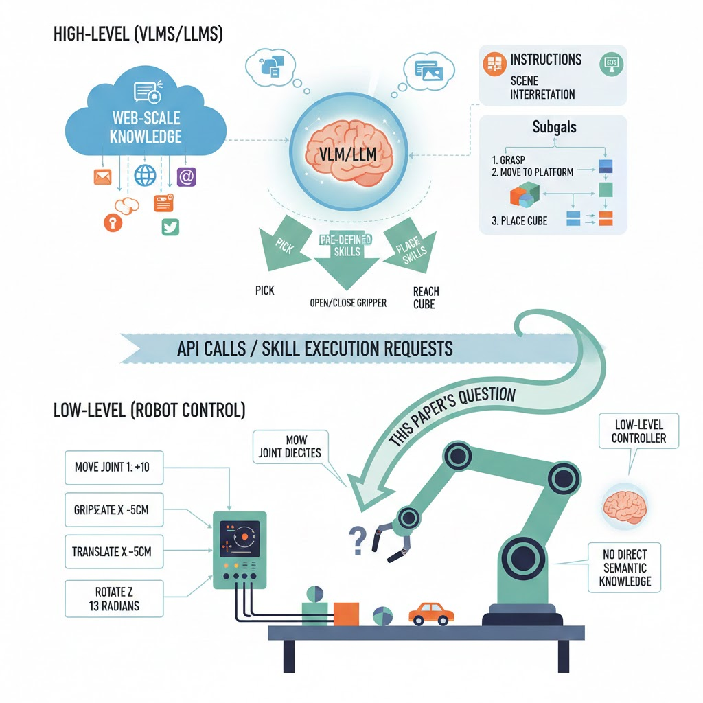
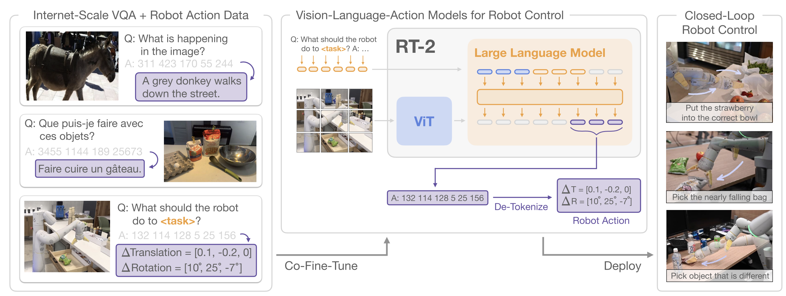

# RT-1

Link: [https://arxiv.org/abs/2212.06817](https://arxiv.org/abs/2212.06817)

Robotics Transformer 1: open-ended task-agnostic training, high-capacity architectures/model.

## Problem

Over the last few years, machine learning has been moving away from small-scale dataset and model toward large, general models pretrained on broad, large datasets in vision, NLP and other domains. The reason that it become a trend is simple, once a model has absorbed a lot of generic knowledge during pretraining, it can often perform well on a new, specific task much faster, sometime even zero-shot, or with only a small amout of task-speific data.

The researchers from [Google Robotics](https://deepmind.google/blog/) tried to bring this idea into robotics: instead of training a separate policy for every task, they want to train **a single, capable, large multi-task backbone model on data consisting of a wide variety of robotic tasks**. But there are two main challenges, data and model. The first is about assembling the right dataset that combine both scale and breadth; the second is about designing the right model, a high capacity model like Transformer.

Even though transformer-based robot policies already existed, the authors focuses on a very practical question: **Can a transformer policy be both big, general and fast enough for real-time robot control?** Google’s work adds stronger evidence that **one multi-task, language-conditioned policy** can learn many robot skills from diverse demonstrations. They also scale up the experiments (more tasks, objects, scenes) and propose design choices that make large-scale robot learning more feasible.

## Dataset

They use mobile manipulators from [Everyday Robots](https://everydayrobots.com/), which have a 7 degree-of-freedom arm, a two-fingered gripper, and a mobile base (see (d)). To collect data and evaluate our method, the researches use three kitchen-based environments: two real office kitchens (see (b, c)) and a training environment modelled off these real kitchens (see (a)). 

The training data consists of human-provided demonstrations, each episode with a textual description of the instruction that the robot just performed. The instructions usually contain
**a verb** and **one or more nouns** describing the target objects. 

To group these instructions together, they split them into a number of skills (e.g., verbs such as “pick”, “open” or “place upright”) and objects (e.g., nouns such as “coke can”, “apple”, or “drawer”). The largest dataset contains over **130k individual demonstrations(trajectories)** constituting over **700 distinct task** instructions using a large variety of objects (see (f)).

## Model Input and Output

**Input:** A history of 6 images of resolution 300×300, a natural language instruction (task description).

**Model Output:** The tokenized actions for the robot at each time step.

The actions consist of **seven** dimensions for the **arm movement** (x, y, z, roll, pitch, yaw, opening of the gripper), **three** dimensions for **base movement** (x, y, yaw) and **a** discrete dimension to **switch between three modes**: controlling the arm, the base, or terminating the episode.

## Model Structure

The model is built on a Transformer architecture ([Vaswani et al., 2017](https://arxiv.org/abs/1706.03762)) and takes **two inputs**: a **history of 6 RGB images** and a **natural-language instruction**.

The instruction is first encoded into a fixed-length embedding and used to **condition** a pre-trained **EfficientNet-B3** ([Tan & Le, 2019](https://www.notion.so/RT-series-2df559a021ef803b97e8d2eca4d1486b?pvs=21)) through **FiLM** ([Perez et al., 2018](https://arxiv.org/abs/1709.07871)) layers. The resulting vision-language features are then **compressed by TokenLearner** ([Ryoo et al., 2021](https://arxiv.org/abs/2106.11297)) into a smaller set of visual tokens and passed to a **decoder-only Transformer**, which predicts **tokenized actions**.

### Instruction and image tokenization

Each image is resized to **300×300×3** and passed through an **ImageNet-pretrained EfficientNet-B3**, producing a final convolutional feature map of shape **9×9×512**. This 9×9 grid is then flattened into **81 visual tokens** (each token is a 512-dim vector).

The instruction is encoded using the **Universal Sentence Encoder (USE)** ([Cer et al., 2018](https://arxiv.org/abs/1803.11175)) into a **single sentence embedding** (a fixed-length vector). RT-1 uses this embedding to **condition** the EfficientNet via **FiLM** (Feature-wise Linear Modulation). Concretely, for intermediate visual features $h$ `(hidden_dim, hidden_dim, channels)`, FiLM applies a per-channel affine transform (for each channel $c$, we apply a separate scale $\gamma$ `(1, 1, channels)` and shift $\beta$ `(1, 1, channels)`):

$$
h' = \text{FiLM}(h) = \gamma(e)\odot h + \beta(e)
$$

where $\gamma(e)$ and $\beta(e)$ are learned functions of the instruction embedding, they initilized with $\gamma$≈1, $\beta$≈0 to keep the output of the pretrained EfficientNet identity initially. And $\odot$ denotes element-wise multiplication,:

$$
h'[:,:,c] = \gamma_c \cdot h[:,:,c] + \beta_c .
$$

(Here $\gamma$ and $\beta$ are broadcast across the spatial dimensions.) 

The image and instruction tokenization via FiLM EfficientNet-B3 is a total of **16M** parameters,
with 26 layers of MBConv blocks and FiLM layers, which output **81 vision-language tokens**.

### TokenLearner

To further compress the number of tokens that RT-1 needs to attend over and thus speed up inference, TokenLearner ([Ryoo et al., 2021](https://arxiv.org/abs/2106.11297)) is an element-wise attention module that used to subsample the **81 visual tokens** that come out of the pre-trained FiLM-EfficientNet layers to just **8 final tokens** that are then passed on to the Transformer layers.

### Transformer

These **8 tokens per-image**, totally 6*8=48 tokens are then concatenated to form 48 total tokens (with added position encoding) to be fed into the Transformer backbone of RT-1. The Transformer is a **decoder-only** sequence model with **8 self-attention layers** and 19M total parameters that outputs action tokens.

### Action tokenization

To tokenize actions, each action dimension in RT-1 is discretized into **256 bins**. As mentioned previously, the action dimensions we consider include **7 variables for the arm movement** (x, y, z, roll, pitch, yaw, opening of the gripper), **3 variables for base movement** (x, y, yaw) and **a discrete variable** to switch between three modes: controlling arm, base or terminating the episode. For each variable, we map the target to one of the 256 bins, where the bins are uniformly distributed within the bounds of each variable.

### Speed up Inference

RT-1 speeds up inference in two ways. First, it uses **TokenLearner** to compress EfficientNet’s visual feature map into **fewer visual tokens**, so the Transformer has less to process. Second, because RT-1 consumes a **sliding window of recent images**, it **caches** the visual tokens for frames it has already seen and reuses them in the next timestep’s window. These two tricks yield about **2.4×** and **1.7×** speedups, respectively.

# RT-2

Link: [https://arxiv.org/abs/2307.15818](https://arxiv.org/abs/2307.15818)

Robotics Transformer 2: co-fine-tune sota VLM, actions as tokens

## Problem

High-capacity models pretrained on broad web-scale datasets have become a strong foundation for many downstream tasks. Large language and vison-language models often show surprisingly broad abilities, such as reasoning, problem solving, and robust visual understanding. Such capabilities would be tremendously useful for generalist robots that must perform a variety of tasks in real-world environments. So the natural question is: **can we combine the semantic knowledge of pretrained VLMs with robot control?**

However, it is unclear how robots should acquire these “web-scale” capabilities. If we follow a brute-force path, the collected millions of robot interaction trials as training dataset doesn’t scale well so it’s nowhere near the data volume used to train modern VLMs. But directly using a VLM for robotics is also difficult: VLMs operate in the world of text and semantics, but a robot needs **low-level direct movement commands**, like ‘move the gripper left/right/up/down and open/close the hand.’

Many recent robotics systems therefore use LLMs/VLMs mainly for **high-level thinking**: the model helps interpret instructions and scenes, then break them into subgoals. After that, the system calls pre-defined skills (like pick/place) which are executed by separate low-level controllers. In these pipelines, the low-level policy often doesn’t directly benefit from the rich visual-semantic knowledge learned from the web.
Then, this paper tries to answer the question: **can large pretrained VLMs be integrated directly into low-level robotic control to boost generalization and enable emergent semantic reasoning?**

## Model

In RT-2, a **Vision-Language-Action (VLA) model** is basically a **normal vision-language model** (image + text → text) that is also trained to output robot actions, by treating actions as another kind of “text.”

RT-2 takes a pretrained VLM, they choose **PaLI-X**([Chen et al., 2023a](https://arxiv.org/abs/2305.18565)) and **PaLM-E**([Driess et al., 2023](https://arxiv.org/abs/2303.03378)), and then **fine-tunes it to output low-level robot actions** directly. To make this possible, they **encode each robot action as a short string of tokens**, just like a text answer in VQA.

### How an action becomes “text”

The robot action space includes **6-DoF end-effector motion** (position + rotation), **gripper openness**, and a **terminate** command. All continuous dimensions are **discretized into 256 bins** (uniformly). Each action step becomes **8 integers** (one per dimension / command). They format the target like a “sentence” of numbers (tokens separated by spaces), e.g. something like:

`"terminate Δposx Δposy Δposz Δrotx Δroty Δrotz gripper_extension"`

### Training: co-fine-tuning

The researchers don’t only fine-tune on robot demonstrations. They **co-fine-tune** on: **robot trajectory data** (instruction + images → action tokens) and the original **internet-scale vision-language tasks** (captioning, VQA, etc.). This helps the model keep its web knowledge and improves generalization.

### Define VLA

One model that can understand **vision** (camera images), follow **language** (instructions), and produce **actions** (robot control commands), all in one shared token-generation framework. So strictly speaking, for this definition, RT1 is not a VLA…

### Real-time control

These models can be huge (up to **55B**). They run them for real robots by deploying in a **cloud TPU service** and querying over the network; they report control frequencies like **~1–3 Hz** for 55B and **~5 Hz** for smaller versions.

# References

1. Brohan, A., Brown, N., Carbajal, J., *et al.* “RT-1: Robotics Transformer for Real-World Control at Scale.” *arXiv* preprint arXiv:2212.06817 (2022). [https://arxiv.org/abs/2212.06817](https://arxiv.org/abs/2212.06817)
2. Google DeepMind Blog. “Google Robotics.” [https://deepmind.google/blog/](https://deepmind.google/blog/)
3. Everyday Robots. “Everyday Robots (website).” [https://everydayrobots.com/](https://everydayrobots.com/)
4. Vaswani, A., Shazeer, N., Parmar, N., *et al.* “Attention Is All You Need.” *arXiv* preprint arXiv:1706.03762 (2017). [https://arxiv.org/abs/1706.03762](https://arxiv.org/abs/1706.03762)
5. Tan, M., & Le, Q. “EfficientNet: Rethinking Model Scaling for Convolutional Neural Networks.” *arXiv* preprint arXiv:1905.11946 (2019). *(Also published in ICML 2019.)*
6. Perez, E., Strub, F., de Vries, H., Dumoulin, V., & Courville, A. “FiLM: Visual Reasoning with a General Conditioning Layer.” *arXiv* preprint arXiv:1709.07871 (2017). [https://arxiv.org/abs/1709.07871](https://arxiv.org/abs/1709.07871)
7. Ryoo, M. S., Piergiovanni, A., Arnab, A., Dehghani, M., & Angelova, A. “TokenLearner: What Can 8 Learned Tokens Do for Images and Videos?” *arXiv* preprint arXiv:2106.11297 (2021). [https://arxiv.org/abs/2106.11297](https://arxiv.org/abs/2106.11297)
8. Cer, D., Yang, Y., Kong, S.-Y., *et al.* “Universal Sentence Encoder.” *arXiv* preprint arXiv:1803.11175 (2018). [https://arxiv.org/abs/1803.11175](https://arxiv.org/abs/1803.11175)
9. Brohan, A., Chebotar, Y., Finn, C., *et al.* “RT-2: Vision-Language-Action Models Transfer Web Knowledge to Robotic Control.” *arXiv* preprint arXiv:2307.15818 (2023). [https://arxiv.org/abs/2307.15818](https://arxiv.org/abs/2307.15818)
10. Chen, X., Wang, X., Changpinyo, S., *et al.* “PaLI-X: On Scaling up a Multilingual Vision and Language Model.” *arXiv* preprint arXiv:2305.18565 (2023). [https://arxiv.org/abs/2305.18565](https://arxiv.org/abs/2305.18565)
11. Driess, D., Xia, F., Hafner, D., *et al.* “PaLM-E: An Embodied Multimodal Language Model.” *arXiv* preprint arXiv:2303.03378 (2023). [https://arxiv.org/abs/2303.03378](https://arxiv.org/abs/2303.03378)