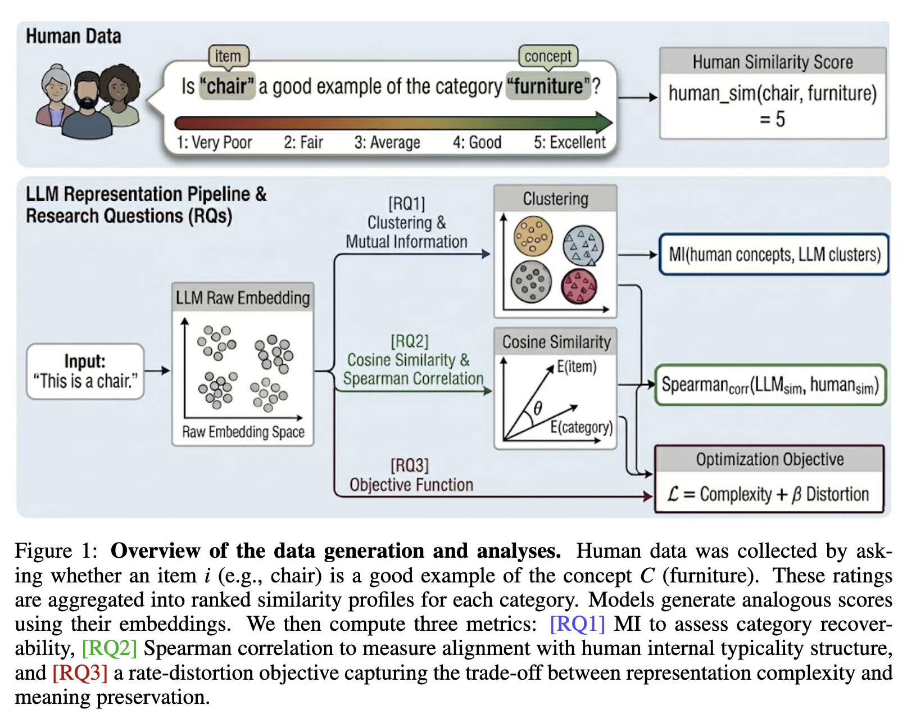

<aside>

Paper resource: [https://arxiv.org/pdf/2505.17117](https://arxiv.org/pdf/2505.17117)

</aside>

## 1 Introduction

Large Language Models have demonstrated impressive abilities in tasks such as categorization, generalization, and text generation. This behaviors often appear human-like, raising a question whether LLMs represent meaning in ways similar to human cognition. However, behavioral similarity alone does not guarantee that the underlying representations are the same.

This note holds the  key background concepts from Machine Learning and Information Theory that are necessary to follow the paper.

## 2 Embeddings

### 2.1 Words as Vectors

An embedding space is a high-dimensional numerical space where words, phrases, images, or other data types are represented as vectors. These vectors capture the meaning, properties, or relationships between the inputs in a way that machines can use for processing and comparison.

Each embedding encodes information about a word’s usage and meaning based on patterns observed during training.

### 2.2 Distance and Similarity

In embedding space semantically or contextually similar Vectors are placed closer together. For example:

- Words like dog and cat tend to be closer together
- Words like dog and car tend to be farther apart

This allows models to reason about similarity using simple geometric operations such as cosine similarity or Euclidean distance.

### 2.3 Categories as Clusters

Groups of related words naturally form clusters. These clusters can be represented as categories or concepts (e.g. birds, animals, tools).

In the paper, embedding space is treated as the conceptual space of the model. This interpretation enables direct comparison between human-defined categories and model-defined clusters.

## 3 Information Theory

Both bioligical and artificial system face fundamental constraints on memory and computation, which force any conceptual system to manage trade-off between:

- Compression: grouping many items into few categories
- Meaning preservation: maintaining coherent and informative grouping.

### 3.1 Mutual Information

Mutual Information (MI) is a central concept in information theory that measures how much information one variable provides about another.

Intuition: If I know one variable, how much does that reduce my uncertainty about the other?

If two variables are completely independent, knowing one tells us nothing about the other, and their mutual information is zero. If they are strongly related, mutual information is high, meaning that observing one gives substantial information about the other.

In the context of categorization, mutual information can be understood as:

- how informative a category label is about the individual items it contains
- or how much detail about an item is preserved after it has been grouped into a category.

### 3.2 Rate-Distortion Theory (RDT)

Rate–Distortion Theory provides a formal framework for understanding the trade-off between compression and information loss.

It describes the relationship between:

- Rate: How much information is used to encode distinctions
- Distortion: how much information is lost during compression.

This framework is used for categorization. When many individual items are grouped into a small number of categories, the system achieves compression, but internal differences between items may be lost. Rate–Distortion Theory allows us to quantify how much information is retained and how much is sacrificed under such grouping.

### 3.3 Information Bottleneck (IB)

The Information Bottleneck framework builds on similar ideas, but introduces an important distinction between relevant and irrelevant information.

In this setting, an input representation is compressed in a way that preservesonly the information that is useful for a specific task or prediction. Variation that does not contribute to the task is treated as noise and can be removed.

In the context of conceptual representations, the Information Bottleneck provides a way to formalize how systems prioritize certain semantic distinctions while ignoring others.

## 4 Measuring Similarity: Spearman Correlation

Sperman’s correlation coefficient ρ represents the agreement between two rankings. Its values range from:

- 1: perfect agreement
- 0: no relationship
- -1: perfect disagreement

In cognitive experiments, humans often provide ranked judgments, such as typicality ratings. Models also produce ranked output, such as similarity scores.

Spearman correlation allows researchers to asses whether humans and models rank items in a similar way, making it well suited for comparing internal conceptual structure.

---

## 5 Content

This paper studies whether **LLMs represent meaning like humans**, beyond just producing human-like behavior. Humans build concepts by **compressing** many different objects into a few categories (e.g., *robin*, *sparrow* → “bird”), but still keep enough structure to preserve useful meaning. The authors ask if LLMs make a similar **trade-off between compression and semantic fidelity**, or if they encode concepts in a fundamentally different way.

To test this, the paper introduces an **information-theoretic framework** based on **Rate–Distortion Theory** and the **Information Bottleneck**. In simple terms, the framework measures how efficiently a system can group items into concepts: **higher compression** means fewer distinctions stored, while **lower distortion** means meaning is preserved better. This creates a principled way to compare how humans vs models balance “efficient representation” vs “semantic richness.”

The key result is that **LLMs do learn broad human-like categories**, meaning their embeddings often cluster items in ways that match human category boundaries. However, they **fail more often on fine-grained structure**—the subtle distinctions humans care about for real understanding (like typicality and nuanced semantic organization inside a category).

More fundamentally, the paper finds that **LLMs are biased toward aggressive compression**, achieving more “efficient” encoding under the information-theoretic objective, but losing semantic nuance. Humans look “inefficient” by that same metric, but this may be exactly the point: human concepts preserve extra detail for **flexibility, context sensitivity, and richer meaning**, not just statistical efficiency.

A final notable finding is that **some encoder-style models can align better with human concept structure than much larger decoder-only models**, suggesting that “understanding-like” representations do not automatically improve just by scaling generative LLMs.

