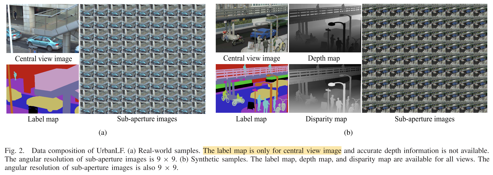

<aside>

Paper link: [https://ieeexplore.ieee.org/document/9810920](https://ieeexplore.ieee.org/document/9810920)

Github repo: [https://github.com/HAWKEYE-Group/UrbanLF](https://github.com/HAWKEYE-Group/UrbanLF)

</aside>

## 1 Abstract

As one of the fundamental technologies for scene understanding, **semantic segmentation** has been widely explored in the last few years. Light field cameras encode the geometric information by simultaneously recording the spatial information and angular information of light rays, which provides a new way to solve this **semantic segmantation** issue.

This paper proposes a high-quality and challenging urban scene dataset, containing **1074** samples composed of **824 real-world** and **250 synthetic** light field images as well as pixel-wise annotations for **14 semantic classes**. It is the largest and the most diverse light field dataset for semantic segmentation (As of 2022, when the paper was published). 

There are also two new semantic segmentation baselines tailored for light field and compare them with state-of-the-art RGB, video and RGB-D-based methods using the proposed dataset. 

The outperforming results of the baselines demonstrate the advantages of the geometric information in light field for the semantic segmentation task. There are also evaluations for super-resolution and depth estimation methods, showing that the proposed dataset presents new challenges and supports detailed comparisons among different methods. 

<aside>

Two main contributions of this paper:

1. a large-scale LF dataset called UrbanLF
2. two new LF semantic segmentation baselines
</aside>

## 2 Introduction

Existing semantic segmentation methods can be divided into **four categories** based on **the type of input data.** There are **RGB images**, **video sequences**, **RGB-D** and **point-cloud**. The latter two approaches utilize geometric and structural information in 3D data to further improve accuracy. However, there are some defects in these algorithms. So this paper proposed a new comprehensive light field (LF) dataset named **UrbanLF** for semantic segmentation. A LF is 4-dimension which not only contains intensity but also direction of light rays. LF benefits semantic segmentation in several ways.

## 3 The UrbanLF Dataset

A large-scale LF dataset called **UrbanLF** includes **824 real-world** samples ****with **623 × 432** and **250 synthetic** samples with **640 × 480**. Disparity range of them are both from **−0.47 to 1.55** between adjacent views.

For real-world data, the annotations of central sub-aperture images are realized by **human labour** via **LabelMe**. For synthetic data, **Blender** generates completely accurate label maps, depth maps and disparity maps of the scene, greatly reducing the demand for manual effort. The extra semantic annotations and depth information for all 81 views broaden the scope of application of synthetic data.

UrbanLF is split into training, validation and test set approximately at a ratio of **7:1:2**.

|  | Training | Validation | Test | Total |
| --- | --- | --- | --- | --- |
| UrbanLF-Real | 580 | 80 | 164 | 824 |
| UrbanLF-Syn | 172 | 28 | 50 | 250 |

Then they can used in Semantic Segmentation, Super Resolution and Depth Estimation tasks.