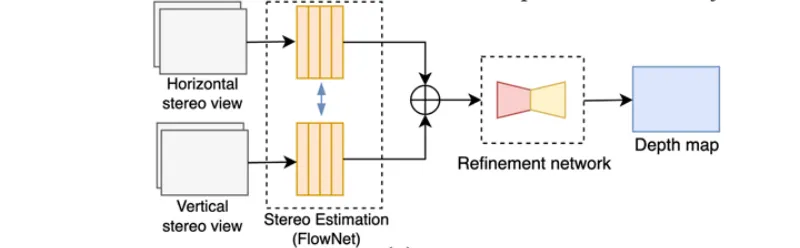
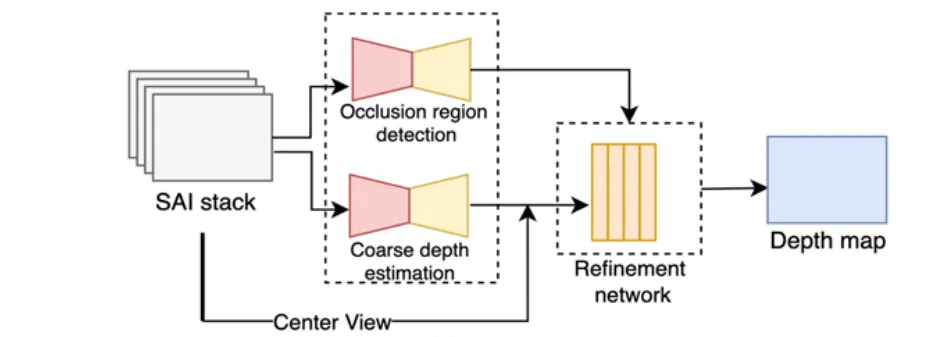
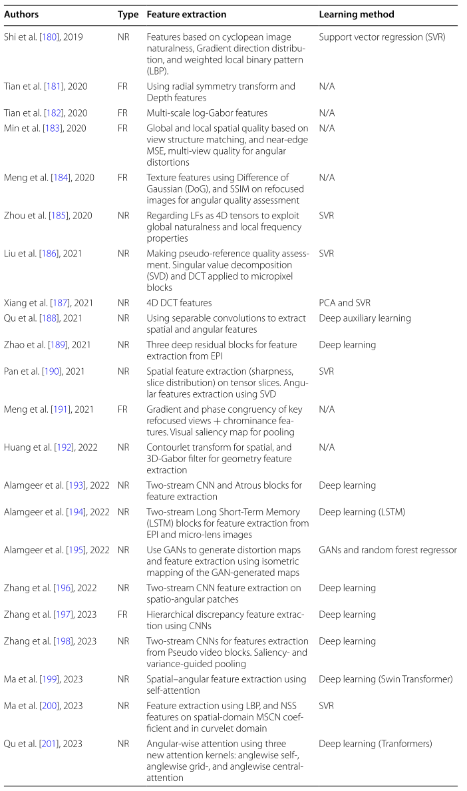
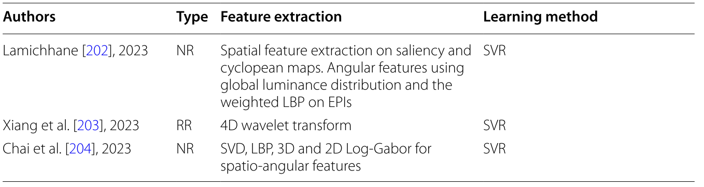

# Initial Impression

<aside>
👉🏼

The light field refres to the representation of a scene. Unlike the tranditional 2D image, it adds an extra dimention: the direction of light. This means each image captures not only the length and width, but also the direction of light. 

- Traditional image: **2D spatially** (width, height), but each pixel carries a **3-value vector** (RGB, 3 channels for color).
- Light filed(width, heidht, X-direction, Y-direction): **4D images**, but each pixel carries a **3-value vector.**

As a result, light field data is massive and challenging to process. 

To address it, researchers have turned into machine learning to efficiently handle and enhance light field imaging. 

</aside>

The paper mentions 4 main areas that AI can helps: 

1. Depth estimation 
2. Reconstruction 
3. Compression
4. Quelity evaluation

# Abstract

<aside>
👉🏼

**Content:**

1. Background
2. Motivation
3. Research focus
4. Paper content
    1. the existing learning-based solutions
    2. frameworks
    3. evaluation methods
    4. datasets
    5. future research directions
</aside>

### Background

- Traditional cameras capture only 2D images.
- Light field imaging records the direction of light rays, enabling realistic and immersive 3D-like representations.

### Motivation

- Light field data provides richer visual information but comes with large data volume and high computational cost.
- Machine learning and deep networks offer efficient and intelligent ways to process this data.

### Research Focus

Learning-based methods are applied to:

- Depth estimation
- Reconstruction and super-resolution
- Compression and quality enhancement

### Paper Goals

The paper surveys existing learning-based techniques, summarizes the most promising frameworks, reviews current datasets, and evaluation methods and outlook for future research directions.

---

# 1. Introduction

<aside>
👉🏼

**Content:** 

1. Concept and potential of light field imaging  
2. Market growth and application fields  
3. Technical challenges and processing tasks  
4. Shift toward learning-based solutions  
5. Purpose and structure of the paper  
</aside>

### Concept and Potential

- **Light field imaging** is a promising **3D imaging technology** that records light rays traveling through every point in space and in every direction.
- Unlike 2D photography, it captures **angular information**, providing a sense of **depth**, **realism**, and **immersion**.
- This enables **photo-realistic rendering** and supports **6-DoF (Degrees of Freedom)** experiences for next-generation immersive media, broadcasting, and gaming.

### Market and Applications

- The **light field market** is expanding rapidly, driven by **glasses-free 3D displays** and **multi-view visualization systems**.
- It supports a range of applications such as **virtual reality**, **augmented reality**, **3D reconstruction**, and **computational photography**.

### Challenges and Processing Tasks

- High-dimensional light field data introduces issues like **data redundancy**, **storage complexity**, and **inter-view correlation**.
- Essential processing tasks include:
    - **Spatial and angular super-resolution** to enhance image quality
    - **Compression algorithms** for efficient data storage and transmission
    - **Depth estimation** for 3D scene reconstruction
- These tasks are **more complex** than traditional 2D image processing due to added angular dimensions.

### Shift Toward Learning-Based Solutions

- Traditional geometry-based methods struggle with large datasets and occlusion problems.
- **Deep learning** and **data-driven frameworks** now dominate, improving efficiency and performance in reconstruction, compression, and depth estimation.
- Learning frameworks enable **automation** and **scalability**, addressing the computational challenges of high-dimensional data.

### Purpose and Structure of the Paper

- This review provides a **comprehensive overview** of **learning-based solutions** for light field imaging.
- It discusses:
    1. **Fundamentals of light field imaging** and data acquisition
    2. **Key processing tasks** and related learning frameworks
    3. **Benchmark datasets** and **evaluation methods**
    4. **Current challenges** and **future research directions**
- The goal is to summarize progress, identify open issues, and provide a **roadmap for future research** in learning-based light field processing.

---

# 2. Light field imaging background

<aside>
👉🏼

**Content:**

1. Light field fundamentals
2. Light field **acquisition**
3. Light field **visualization**
</aside>

## 2.1 Light Field Fundamentals

<aside>
👉🏼

**Content:**

1. Concept of the Plenoptic Function
2. Dimensional Reduction
3. Light Field Representation
</aside>

### Concept of the Plenoptic Function

- To reproduce realistic 3D scenes, cameras must capture light from **many viewpoints**.
- A **light field** describes all light rays in 3D space — their **positions**, **directions**, **colors**, and **intensity**.
- The complete description is given by the **plenoptic function**, a 7-dimensional (7D) function:
    
    $$
    P(θ, φ, λ, τ, V_x, V_y, V_z)
    $$
    
    which includes direction, wavelength, time, and position of every ray in space.
    

### Dimensional Reduction

- Capturing the full 7D plenoptic function is practically impossible.
- Under constant lighting and static scenes, **wavelength (λ)** and **time (τ)** can be ignored.
- This simplifies the representation to a **5D function**:

$$
P(θ, φ, V_x, V_y, V_z)
$$

- The 5D form forms the foundation for **Neural Radiance Fields (NeRF)**, while further simplification leads to a **4D light field** representation.

### Light Field Representation

- **Two-Plane Parameterization**
    - The **4D light field** assumes light rays travel in straight lines.
    - Each ray is defined by its intersection with two parallel planes:
        - **(u, v)** → spatial coordinates on the image/focal plane (Ω)
        - **(s, t)** → coordinates on the camera plane (Π)
    - The resulting function:
    
    $$
    P(u, v, s, t)
    $$
    
    
    
    - defines the light field in terms of **spatial** and **angular** information.
    - This **two-plane parameterization** makes light fields easier to store, process, and compress using 2D image arrays.
    - A 4D light field can be expressed as **an array of 2D images** indexed by (u, v) for spatial coordinates and (s, t) for different viewpoints.
    - This enables the use of **standard 2D codecs** for compression and **native 2D algorithms** for processing.
- **Epipolar Plane Image (EPI)**
    - **Epipolar Plane Image (EPI)**, a 2D slice of the light field showing spatial–angular relationships.
        - Looks like a single **2D picture** made by stacking the same pixel row from all those camera views.
        - Coordinates → (u, s) or (v, t) (only one spatial + one view direction)
    - In the EPI, each object in the scene becomes a **slanted line**:
        - If an object is **close**, its line is **steeper** (because it moves more between views).
        - If it’s **far**, its line is **flatter** (moves less).
    - Lines in the EPI correspond to scene depth — analyzing their slopes allows **depth estimation** and **3D reconstruction**.
    
    
    
    **Epipolar Plane Image (EPI)**
    

## 2.2 Light Field Acquisition

<aside>
👉🏼

**Acquisition methods:**

1. Single-Camera Systems
2. Multi-Camera Arrays
3. Other Methods
    1. Computer-generated light fields
    2. Handheld or SLAM-based systems
    3. LiDAR-assisted capture
</aside>

### Overview

Light fields can be acquired by single plenoptic cameras, camera arrays, or synthetic and LiDAR-based systems, each balancing data density, resolution, and complexity.

### Single-Camera Systems

- **Plenoptic (lenslet-based) cameras** use microlens arrays to capture dense angular information in one shot.
- Examples: **Raytrix** and **Lytro** cameras.
    - Lytro → The **Lytro camera** captures a 4-D light field by recording many tiny viewpoint images through its microlens array — those images form the **SAI stack.**

### Multi-Camera Arrays

- **Arrays of monocular cameras** (planar or spherical) capture scenes from different viewpoints.
- The camera layout defines the angular sampling and overall field of view.

### Other Methods

- **Computer-generated light fields** provide accurate depth maps for benchmarking.
- **Handheld or SLAM-based systems** reconstruct light fields from multiple frames.
- **LiDAR-assisted capture** combines sensors and cameras for precise, automated 3D data.

## 2.3 Light field visualization

<aside>
👉🏼

**Content:** 

1. Goal and use cases 
2. Visualization approaches 
3. Display principles and challenges 
4. Perceptual limitations
</aside>

### Goal and Use Cases

- The main goal is to **provide a true 3D visual experience**, essential for immersive and interactive applications.
- Visualization may be **passive** (no interaction) or **active** (viewer can move or rotate objects).
- Used in areas like **medical imaging**, **VR/AR**, and **3D display systems**.

### Visualization Approaches

- Based on the **4D light-field representation** combining spatial and angular data.
- **Passive** use cases render fixed views; **active** use cases synthesize new views via **view interpolation**. (**View interpolation** means **creating new viewpoints** images that were **never actually captured by a real camera**, but are **mathematically generated** from nearby real ones.
- Rendering quality strongly influences perceptual realism.

### Display Principles and Challenges

- Two key properties:
    - **Angular resolution** (baseline between views)
        - the **baseline** = the **distance between two camera viewpoints**.
            - **Small baseline** → cameras are **close together**
            - **Wide baseline** → cameras are **far apart**
    - **Spatial resolution** (image detail)
- 3D displays must reproduce directional light rays accurately to recreate depth and realism.
- Capturing dense samples and rendering multiple view angles remain **computationally demanding**.

### Perceptual Limitations

- Standard 2D displays lack realistic cues like **vergence** and **accommodation**, limiting immersion.
- **Light-field displays** address this by replicating real light rays to the viewer’s eyes but face:
    - Finite ray sampling
    - **Vergence–accommodation conflict**
    - Restricted field of view (FoV)
    - **Horizontal- or vertical-parallax-only designs** causing viewing discomfort.

---

# 3. Learning‑based light field processing

<aside>
👉🏼

Content:

1. Depth estimation
    1. Autoencoders
    2. Stereo matching and refinement
    3. End‑to‑end feature extraction and disparity regression
2. Light field reconstruction
    1. Spatial super‑resolution
        1. Single‑view super‑resolution and refinement
        2. End‑to‑end residual learning
    2. Angular super‑resolution
        1. EPI super‑resolution
        2. Depth estimation and warping
        3. Multi‑plane image generation
    3. Spatio‑angular reconstruction
    4. Neural scene representation
3. Compression
    1. Learning‑based view synthesis on the decoder side
    2. Learning‑based view synthesis on the encoder and decoder sides
    3. End‑to‑end light field compression architecture
4. Other light field imaging applications
</aside>

This section summarizes the most prominent **light field processing tasks** studied in the literature and highlights the **learning-based imaging techniques** deployed for each processing task.

**Terms** and explanation:

| Term | Simple meaning | Example / Analogy |
| --- | --- | --- |
| **EPI volume** | Stack of many light-field slices showing how points move across views | Like stacking many thin image strips to form a 3D block |
| **Stereo view** | Two or more photos of the same scene from different angles | Like your left and right eye views |
| **SAI stack** | Group of small 2D images from a light field camera | Like a grid of mini photos from slightly different directions |
| **Depth map** | Image showing distance of each pixel (white = near, black = far) | Like a 3D scanner’s output |
| **Disparity volume** | 3D data showing pixel shifts between views | Large shift → close object, small shift → far object |

Details about the difference between **Light Field representation**:

| Term | Relation to Two-Plane Parameterization | Simple meaning |
| --- | --- | --- |
| **EPI** | A **slice** through the Two-Plane representation. | Shows pixel movement (as slanted lines) between multiple views — used for depth estimation. |
| **Stereo view** | it’s a **simpler / smaller subset** of the Two-Plane model (only 2 views). | Like taking only the left and right images from the light field. |
| **SAI stack** | it’s directly sampled from the Two-Plane model (a grid of (s, t) views, each with its own (u, v) image). | Many small 2D images from slightly different viewpoints — a practical way to store the light field. |

Relationship between **Disparity volume** and **Depth map:**

| Concept | Type | What it represents | Used for |
| --- | --- | --- | --- |
| **Disparity volume** | 3D data (x, y, disparity) | All possible matching shifts between views | Intermediate step (to find the best match) |
| **Depth map** | 2D image (x, y), 3D data (x, y, depth) | Actual distance of each pixel | Final result |

Disparity and depth are **inversely related**:

$$
\text{Depth} = \frac{f \times B}{\text{Disparity}}
$$

where:

- (f) = focal length of the camera,
- (B) = distance between two camera views (baseline).

So:

> Large disparity (big shift) → close object.
Small disparity (tiny shift) → far object.
> 

Depth map

## 3.1 Depth estimation

<aside>
👉🏼

Three main approaches:

1. Autoencoders
2. Stereo matching and refinement
3. End-to-end feature extraction and disparity regression
</aside>

Depth estimation model architecture

### Overview

- **Goal:** Estimate the **distance of each pixel** from the camera to recover the scene’s 3D structure.
- Light field imaging enables capturing a scene from multiple viewpoints so depth information is implicitly encoded in the light field representation and can be acquired by computing the inter-view pixel disparity information. **disparity volume → depth map**
- Main challenges: **occlusions**, **non-Lambertian surfaces**, and **texture-less regions**, which make accurate estimation difficult.
    - A **Lambertian surface** is an *ideal matte surface* — it reflects light **equally in all directions**. That means no matter where you look from, the brightness of that point **stays the same**.
- Recent progress focuses on **learning-based approaches**, achieving higher accuracy than traditional geometry-based methods.

### Autoencoders

- Take an **EPI volume** → compress it (encoder) → learn the hidden features → expand it (decoder).
- Classical **method:**
    - **Heber & Pock**:
        - **five-block CNN** estimating line orientation in EPIs;
            - **Orientation** refers to the **direction each camera is facing.**
        - later extended to a **U-shaped encoder–decoder**,
        - Further to  **U-shaped encoder–decoder** with skip connections and 3D filters.
    
    
    
    | Step | Explanation |
    | --- | --- |
    | **Input** | Horizontal and vertical **EPI volumes** (from the light field). Each EPI shows slanted lines — the slope encodes depth. |
    | **Model**  | A **5-block CNN** that scans small “windows” (patches) of the EPI. Each CNN layer extracts features and estimates the **orientation (slope)** of the EPI lines. Later versions evolved into a **U-shaped encoder–decoder** (U-Net) for better reconstruction. |
    | **Output** | A **depth map**, where every pixel’s value = estimated distance from the camera. |
    - **Alperovich et al.**:
        - an **autoencoder** that **encodes** horizontal and vertical EPI stacks simultaneously using six stages of **residual blocks** to improve robustness.
        - Then, the compressed representation is expanded using three **decoder** pathways to
        address the disparity, diffusion, and specularity estimation problems.
        
        
        
        | Step | Explanation |
        | --- | --- |
        | **Input** | Combined **horizontal + vertical EPI stacks** from the light field. |
        | **Model** | An **autoencoder** with: 6 **residual blocks** (for stronger feature extraction) in the encoder, and 3 **decoder branches** (to handle disparity, diffusion, specularity). It compresses the light field into a latent code, then reconstructs richer outputs. |
        | **Output** | A **disparity volume** — a 3D array where each pixel position stores multiple disparity hypotheses (possible shifts). From this volume, a final **depth map** can be derived later. |
- Analysis:
    - **Pros:** captures compact depth features, handles EPI geometry directly.
    - **Cons:** computationally heavy; limited to 2D EPI slices, less effective in occluded regions.

### Stereo Matching and Refinement

- Computes **disparity between SAIs** using neural stereo-matching networks.
- Typical pipeline:
    1. Coarse disparity estimation via networks like **FlowNet 2.0** or encoder–decoder CNNs.
    2. **Refinement** using residual or occlusion-aware learning to correct depth errors.
- **Examples:**
    - **Rogge et al.** (belief propagation + residual refinement);
        
        
        
    - **Guo et al.** (encoder–decoder concatenation of SAIs).
        
        
        
- **Analysis:**
    - **Pros:** exploits full 4D light-field correlations, good for complex geometry.
    - **Cons:** high computation cost; sensitive to reflections and non-Lambertian surfaces.

### End-to-End Feature Extraction and Disparity Regression

- Fully end-to-end CNNs learn features and regress depth directly.
- **Methods:**
    - **Epinet:** Horizontal, vertical, and diagonal SAI stacks → Multi-stream CNN feature extraction → Regression network → **Depth map**
    
    
    
    - **Leistner et al.:** Vertical & horizontal SAI stacks → Siamese U-Net → Autoencoder regression module → Classification + regression fusion → **Depth map**
    
    
    
    - **Two-stream CNN:** Horizontal & vertical EPIs → Multi-scale feature extraction (four convolutional stages) → Feature concatenation → Multi-label regression → **Depth map**
    - **Zhu et al.:** Focal stacks + center view + EPIs → Hybrid feature extraction → Fully connected + softmax layers → Pixel-wise disparity classification → **Depth map**
    - **Tsai et al.:** Multi-view SAIs → Residual blocks + spatial pyramid pooling → Cost volume construction + attention module → Disparity regression → **Depth map**
    
    
    
    - **Multi-scale Cost-Volume Method:** Shifted SAI feature maps (multi-disparity levels) → 4D cost volume (low memory footprint) → Multi-scale feature extraction → Regression → **Depth map**
- **Analysis:**
    - **Pros:** highest accuracy, unified optimization of feature + disparity learning.
    - **Cons:** large data/training demand; reduced performance on wide-baseline scenes.

<aside>
👉🏼

**Summary**:

Depth estimation for the wide baseline scenario, with an acceptable trade-off between accuracy and computation, is still an open research problem.

</aside>

## 3.2 Light field reconstruction

<aside>
👉🏼

**Content:**

1. Spatial super‑resolution
    1. Single‑view super‑resolution and refinement
    2. End‑to‑end residual learning
2. Angular super‑resolution
    1. EPI super‑resolution
    2. Depth estimation and warping
    3. Multi‑plane image generation
3. Spatio‑angular reconstruction
4. Neural scene representation
</aside>

To enable **higher spatial** and **angular** resolutions, the development of light field reconstruction/ super-resolution (SR) methods has gained significant attention.

- **Spatial SR** = make each image (each view) sharper — more pixels, more detail.
- **Angular SR** = make more **viewpoints** — fill in **missing views** between existing ones.

<aside>
💡

**Spatial super-resolution (SR)** focuses on improving the **static spatial resolution** — that is, the sharpness, clarity, and detail of each individual sub-aperture image (still view).

**Angular consistency** ensures **smooth and coherent transitions** between different viewpoints, maintaining stable **motion perception** and correct 3D geometry when the view changes or the scene is refocused.

</aside>

Light-field SR must improve both:

1. **Spatial** resolution → each view looks higher spatial resolution.
2. **Angular** consistency → all views agree about geometry and depth.

| System | Spatial resolution (image sharpness) | Angular resolution (number of viewpoints) | Baseline | Notes |
| --- | --- | --- | --- | --- |
| **Plenoptic camera** | Low | High (dense) | Narrow | Compact but blurry |
| **Camera rig** | High | Low (sparse) | Wide | Sharp but heavy and complex |

### Spatial super‑resolution

Examples of architectures for the spatial, angular, and spatio-angular super-resolution (SR) frameworks. 

- **a** → Single-view SR using single image super-resolution (SISR) network and inter-view enhancement,
- **b** → end-to-end residual learning,
- **c** → warping and residual learning for refinement,
- **d** → multi-plane image generation,
- e → residual learning using 4D CNNs and refinement, ****
- **f** → GAN-based method

---

**Single‑view super‑resolution and refinement**

| Step | Explanation |
| --- | --- |
| **Input (SAI stack LR)** | **SAI stack LR:** all the sub-aperture images captured by the light-field camera. **low-resolution** — each view is blurry and lacks details (because each microlens only captures a small number of pixels). For example, **9×9 SAIs of 60×60 pixels.** |
| **SISR**  | **Single-Image Super-Resolution**: This block applies a **2D super-resolution network (e.g., VDSR)** to each SAI **individually** to ****improve the **spatial resolution.** |
| **HR(init)LF** | **High-Resolution (initial) Light Field**: Each image looks sharper, but the views may no longer be perfectly aligned (angular inconsistency).  |
| **EPI** | **EPIs** (Epipolar Plane Images) are extracted. EPIs capture the **geometric relationships** between views — how pixels shift across viewpoints (slanted lines). |
| **Refinement module** | This is a **learning network** (often a CNN) that analyzes the EPIs to find and correct **misalignments** between neighboring SAIs. Making sure all views agree in depth and structure. |
| **Residual addition** | Combine sharpness from the first stage and consistency from the second stage. |
| **Output (HR LF)** | **High-Resolution Light Field:** The final output light field has: **High spatial resolution** (sharp individual views), and **High angular consistency** (smooth geometry across views). For example, **9×9 SAIs of 240×240 pixels.** |

**End‑to‑end residual learning**

| Step | Explanation |
| --- | --- |
| **Input (SAI stack)** | **SAI stacks (Horizontal, Vertical, Diagonal, Center View), Center view** → the middle image, used as a geometric reference |
| **Feature Extraction** | Each SAI stack is passed through a **feature extraction CNN.** Extract features from each SAI direction, like “what the object looks like” and “how it moves between views.” |
| **Feature Integration & Processing** | The feature maps from all directions (horizontal, vertical, diagonal, etc.) are **merged** or **fused** here. |
| **Upsampling Network** | Increases the **spatial resolution** (i.e., number of pixels). |
| **Output (HR LF)** | The final output is a **high-resolution light field** — a grid of SAIs that are: **Spatially sharper** and **Angularly consistent.** |

**Upsampling** means making an image **larger** — that is, **increasing its resolution** by creating **more pixels**.

---

### Angular super‑resolution

**Angular Super-Resolution (SR)** means **synthesizing new in-between views** to make the light field smoother and more complete. (**view synthesis**)

**EPI super‑resolution**

All of these models have the same **basic structure**:

1. Start from a **blurry / low-angular-resolution** light field (few viewpoints).
2. Use **deep networks** to predict **high-frequency details** (the fine geometry and textures missing in the low version).
3. Reconstruct the **high-angular-resolution (HR) light field**, which includes the new views.

| Step | Explanation |
| --- | --- |
| **Input (SAI stack LR)** | **SAI stack LR:** all the sub-aperture images captured by the light-field camera. **low-resolution** — each view is blurry and lacks details (because each microlens only captures a small number of pixels). For example, **9×9 SAIs of 60×60 pixels.** |
| **SISR**  | **Single-Image Super-Resolution**: This block applies a **2D super-resolution network (e.g., VDSR)** to each SAI **individually** to ****improve the **spatial resolution.** |
| **HR(init)LF** | **High-Resolution (initial) Light Field**: Each image looks sharper, but the views may no longer be perfectly aligned (angular inconsistency).  |
| **EPI** | **EPIs** (Epipolar Plane Images) are extracted. EPIs capture the **geometric relationships** between views — how pixels shift across viewpoints (slanted lines). |
| **Refinement module** | This is a **learning network** (often a CNN) that analyzes the EPIs to find and correct **misalignments** between neighboring SAIs. Making sure all views agree in depth and structure. |
| **Residual addition** | Combine sharpness from the first stage and consistency from the second stage. |
| **Output (HR LF)** | **High-Resolution Light Field:** The final output light field has: **High spatial resolution** (sharp individual views), and **High angular consistency** (smooth geometry across views). For example, **9×9 SAIs of 240×240 pixels.** |

**Depth estimation and warping**

- **Disparity** is the **shift** of the same object’s position between two different views.
- Warping = using disparity to reposition pixels.

| Step | Explanation |
| --- | --- |
| **Input (SAI stack)** | A set of **low-resolution sub-aperture images (SAIs)** |
| **Depth Estimator** | Predicts a **depth map** (distance information) for each SAI or for the entire light field. It learns how far each pixel is from the camera by analyzing geometric cues across views. (wraps_by_an_amount_that_depends_on_its_**depth**) |
| **Warping Module** | Uses the estimated **depth maps** to **warp** (geometrically align) all SAIs toward a common viewpoint — usually the **center view**. “Warping” means shifting pixels according to their depth so that corresponding points from different views line up. |
| **Refinement Module** | Fine-tunes the warped images using a CNN. Corrects small errors from imperfect depth estimation or warping. |
| **Output (HR LF)** | The final reconstructed light field: All SAIs are now **high-resolution** (sharp textures). The views are **geometrically aligned** (consistent depth perception). |

Some basics:

| Concept | Meaning | Why it matters |
| --- | --- | --- |
| **Depth map** | Tells how far each pixel is | Needed to compute correct pixel shift |
| **Disparity** | The actual shift caused by viewpoint change | Derived from depth |
| **Warping** | Moves pixels according to disparity | Aligns all views |
| **Without depth** | All pixels shift equally → wrong alignment | Causes blur and ghosting |

**Multi‑plane image generation (MPI generation)**

| Step | Explanation |
| --- | --- |
| **Input (SAI stack)** | A set of **low-resolution sub-aperture images (SAIs)** |
| **Warping Module** | The **Warping Module** aligns all SAIs to a **reference view (usually the center view)** using a range of **hypothetical depth planes**.  |
| **Plane-sweep volume** | After warping, stacks all these reprojected images together — forming a **plane-sweep volume**. Create a 3D data structure that encodes **how well each depth hypothesis aligns** across views. No explicit depth estimator — depth is **implicitly encoded** in the plane-sweep volume. |
| **3D CNN** | The **3D convolutional neural network** processes the **plane-sweep volume** to analyze spatial and depth correlations. |
| **Multi-plane image** | A **multi-plane image (MPI)** — a set of 2D images, each representing a scene layer at a specific depth, with color + transparency (α) values. |
| **Blending Module** | Combines (blends) all the **multi-plane images (depth layers)** into a single coherent high-resolution light field. |
| **Output (HR LF)** | The final light field: All SAIs are now **high-resolution** and **geometrically aligned**. |

### Spatio‑angular reconstruction

**Residual learning using 4D CNNs and refinement**

| Step | Explanation |
| --- | --- |
| **Input (SAI stack)** | A set of **low-resolution sub-aperture images (SAIs)** |
| **Warping Module** | The **Warping Module** aligns all SAIs to a **reference view (usually the center view)** using a range of **hypothetical depth planes**.  |
| **4D CNN** | A convolutional network that operates directly on the **4D light-field volume**. It jointly learns: **Spatial features** (edges, textures inside each SAI) and **Angular features** (parallax).   The 4D CNN predicts the **missing high-frequency details** for all views simultaneously. |
| **Residual Connection** | This “residual learning” means the 4D CNN only learns the ***difference*** (the missing fine details) rather than reconstructing the entire image from scratch. |
| **Refinement Module** | Polish the HR LF and ensure **angular consistency.** |
| **Output (HR LF)** | **Output: HR LF**The final output = **high-resolution light field**
→ same number of views as the input,
→ each view sharper (higher spatial resolution) and smoothly aligned (angular consistency). |

**GAN-based method**

| Step | Explanation |
| --- | --- |
| **Input (SAI stack)** | A set of **low-resolution sub-aperture images (SAIs)** |
| **Generator** | The generator learns to **upsample** the SAIs and **restore missing details** (edges, textures, angular consistency). |
| **GAN Discriminator** | It is trained on **real HR light fields** (ground truth) and **fake HR light fields** (from the generator). Its job is to **classify** them as *real* or *fake*. Force the generator to create results that are **indistinguishable from real data** — not just pixel-wise accurate but also visually realistic (better textures, depth edges, lighting). |
| **Output (HR LF)** | The **generator alone** can take any new LR light field and output an HR version that: has **high spatial detail**, maintains **angular consistency**, and looks visually realistic (not over-smoothed). |

<aside>
💡

### **Summary: Limitations of LF Reconstruction Techniques:**

1. **Early reconstruction methods**
    - Slow to run.
    - Trained for fixed view sampling patterns → hard to generalize to new setups.
2. **Single-view SR methods (Fig. 3a)**
    - Each sub-aperture image (SAI) is processed separately.
    - Causes **geometric inconsistency** between views because inter-view information isn’t used.
3. **Depth-based & warping methods (Fig. 3c)**
    - Work better for **wide-baseline** cases (larger view spacing).
    - Depend heavily on **accurate depth maps** → errors lead to **tearing**, **ghosting**, and problems with **non-Lambertian (reflective) surfaces**.
4. **MPI-based methods (Fig. 3d)**
    - **Memory-hungry** and **slow to train** (often need multiple GPUs and days of training).
    - Model size grows with number of **depth planes** (larger depth budget → bigger model).
    - Can assign wrong **opacity** to layers → causes **blurry reconstructions**.
5. **4D CNN methods (Fig. 3e)**
    - Produce **high-quality results**,
    - but have **high computational cost** due to expensive 4D convolutions.
6. **GAN-based methods (Fig. 3f)**
    - Need **large training datasets**.
    - Training can suffer from **instability** and **mode collapse** (generator producing limited or repetitive outputs).
</aside>

### **Neural scene representation**

Researchers started using **neural networks** to represent 3D scenes which replaces 2D pictures.

**From image-based to neural 3D representations**

- Earlier works used **image-based rendering** (combine nearby views).
- Recent advances use **neural networks** to represent and render 3D scenes directly.
- 3D representations can be:
    - **Explicit:** meshes, voxels, point clouds.
    - **Implicit:** continuous functions learned by networks + **differentiable ray marching**.

---

**NeRF — the core idea**

- **Neural Radiance Fields (NeRF)** represent a scene using an **MLP** (multi-layer perceptron).
    - The network takes **5D coordinates** → (x, y, z, θ, φ): spatial position + viewing direction.
    - It outputs:
        - **Density (geometry)**
        - **Color (view-dependent radiance)**.
- Rendering is done by **volume rendering** along camera rays.

<aside>
💡

**How NeRF learns the scene**:

1. Feed the network **2D photos** of the same scene taken from **different camera angles**, and you must know exactly where each camera was (its **pose** = position + orientation). → So NeRF knows *which pixel in which image* corresponds to *which ray* in 3D space.
2. NeRF **renders** its current guess (density and color) of those images using its internal 3D representation.
3. It compares them to the real photos (pixel by pixel).
4. It updates its **weights** using backpropagation to minimize the difference.

**To render one image** (for a camera view):

1. For each **pixel**, shoot a **ray** through the 3D scene.
2. **Sample many points** along that ray (like tiny steps through space).
3. At each point, ask the network for its **color and density**.
4. Combine (accumulate) all samples along the ray using a **differentiable volume rendering formula**:
    
    $$
    C = \sum_i T_i (1 - e^{-\sigma_i \Delta_i}) c_i
    $$
    
    where:
    
    - C = final pixel color,
    - $\sigma_i$ = density,
    - $c_i$ = color,
    - $T_i$ = how much light passes through before reaching this point.

This process is known as **differentiable ray marching.**

---

**So the process works like this:**

1. Collect multiple 2D photos of the same scene, taken from different camera angles (with known position and orientation: x, y, z, θ, φ).
2. For each pixel in each photo, sample many 3D points along the corresponding camera ray.
3. For each sampled point, use the network to predict its color and density (or depth).
4. Aggregate the information from all sampled points to estimate the final color of the pixel.
5. Compare the predicted image to the real photo, pixel by pixel, and update the model based on the error.
</aside>

- NeRF uses a **coarse network** (for rough geometry) and a **fine network** (for detailed structure).
- Analysis:
    - Pros: realistic view synthesis.
    - Cons: very **slow training and rendering**.

---

**Methods to improve speed and efficiency**

Several approaches speed up NeRF by changing how the scene is represented, **they replaced the big neural network with simpler structures**:

| Method | Representation | Key idea | Pros / Cons |
| --- | --- | --- | --- |
| **Voxel-based NeRFs** (Fridovich et al.) | Sparse voxel grid | Store opacity + spherical harmonic coefficients | Faster, but memory-heavy |
| **TensoRF** | 4D tensors (low-rank decomposition) | Factorize radiance field into compact tensor components | Efficient, compact |
| **SNeRG** | Sparse 3D voxel grid with color & features | Encodes view-dependent effects | Fast rendering; still large memory |
| **Octree NeRF** (Yu et al.) | Octree structure (adaptive voxels) | Sample dense regions more finely | Faster, but higher memory cost |
| **NeX** | Extended MPI (Multi-Plane Image) | Model color as function of viewing angle using spherical bases | Better view-dependent rendering |
| **Ray-space embedding** | 4D ray embedding → latent space | Compact feature embedding | Memory efficient but slower rendering |
| **KiloNeRF** | Thousands of tiny MLPs | Divide scene into grid cells, each with a small network | Great speed, coarse structure |
| **3D Gaussian representation** | Continuous Gaussians | Skip empty-space computation | Near real-time rendering |
| **Instant-NGP (Müller et al.)** | Hash-based encoding | Store features in hash table for fast lookup | Very fast, compact, GPU-friendly |

---

**Methods to improve quality**

| Variant | Key idea | Benefit |
| --- | --- | --- |
| **Mip-NeRF** | Multi-scale cones for anti-aliased rendering | Handles different resolutions & reduces aliasing |
| **NeRF++** | Two networks: near-field & far-field (spherical) | Better for unbounded, complex scenes |
| **Mip-NeRF 360** | Extends Mip-NeRF for unbounded scenes; uses nonlinear parameterization & regularization | High-quality large-scene rendering |

Trade-offs and current challenges: 

- **Fast methods** (gaussian) → train quickly, but lose visual quality.
- **High-quality methods** (NeRF, Mip-NeRF 360) → photorealistic but **slow to train**.
    - Explicit methods also can’t be optimized directly with gradients → need to **convert** trained implicit NeRFs into their format (adds complexity).
- **Real-time + high-quality rendering** remains an **open research challenge**.

## 3.3 Compression

<aside>
💡

Three main strategies:

1. Learning-based view synthesis on the decoder side; 
2. Learning-based view synthesis on the encoder and decoder sides;
3. End-to-end light field compression architecture;
</aside>

An efficient codec should be able to explore: 

- not only the spatial and angular redundancies independently (as two-dimensional data),
- but also the combined spatial–angular redundancy (4D data).

> **The key idea of this compression architecture is bitrate saving by sparsely encoding
the views.**
> 

---

### **Learning-based view synthesis on the decoder side**

| Step | Explanation |
| --- | --- |
| **Input light fields** | These are the original **dense light-field data**, meaning many sub-aperture images (SAIs) captured from slightly different viewpoints. |
| **Key SAIs selection** | Instead of sending all the views, we select a few **key SAIs**. These key SAIs contain enough angular and spatial information to reconstruct the missing ones later. |
| **Encoder** | The **encoder** compresses these key SAIs into a **bitstream** (binary data) for transmission or storage. |
| **Bitstream** | This is the compressed data that’s transmitted or saved. It contains only **the encoded information of the key SAIs** (no non-key views). |
| **Decoder** | The decoder reconstructs the **key SAIs** from the bitstream. |
| **Learning-based view synthesis** | This is a **deep neural network** trained to **synthesize new views (non-key SAIs)** from the nearby **key SAIs**. Generate all **non-key views** → fill in the gaps to recreate the full light field. |
| **Decoded light fields** | Produce and output the complete **high-quality light field** (same size as the original) after combining Decoded **key SAIs** and Generated **non-key SAIs**. |

### **Learning-based view synthesis on the encoder and decoder sides**

**Idea:**

- **Encode only a few key views** (the main ones),
- **Use deep learning** to **predict or reconstruct** the missing views (non-key views),
- **Send only the residual errors** to refine those predictions.

| Step | Explanation |
| --- | --- |
| **Input light fields** | These are the original **dense light-field data**, meaning many sub-aperture images (SAIs) captured from slightly different viewpoints. |
| **Key SAIs and Non-key SAIs** | The system splits the light field into: **Key SAIs:** a few representative images selected for transmission (e.g., every 3rd or 4th view). **Non-key SAIs:** the remaining views that will be **predicted** rather than transmitted. |
| **Encoder** | Takes two inputs: **Key SAIs** and **Residuals** (for the non-key SAIs), compresses both into a compact **bitstream** (binary data) for transmission or storage. |
| **Learning-based view synthesis  (encoder side)** | This neural network **predicts the non-key SAIs** from the available **key SAIs**. so the encoder can calculate the prediction error (residual) → the difference between the predicted and real non-key SAIs is computed as a **residual**. |
| **Residue** | The encoder subtracts the **predicted non-key SAI** (from the network) from the **actual non-key SAI**. only encode the *difference*, not the entire image — saves lots of bitrate. |
| **Bitstream** | The data sent or stored — contains compressed key SAIs + residuals. |
| **Decoder** | Receives and decompresses the bitstream. Reconstructs the **key SAIs** first. Then passes them to the **learning-based view synthesis network** to generate **predicted non-key SAIs**. |
| **Learning-based view synthesis (decoder side)** | Same (or similar) neural network as on the encoder side. It uses the decoded key SAIs to **synthesize** (predict) the non-key SAIs. Then it adds the **residual** (decoded correction data) to refine those synthesized views. |
| **Addition (+) and output** | The synthesized non-key SAIs are **added** to the decoded residuals → final accurate **non-key views**. Combine **key + non-key SAIs** → get the **fully decoded light field**. |

<aside>
💡

Su et al. → 

- Instead of treating every pixel separately, they group **light rays that belong to the same 3D point in the scene**.
- After grouping rays, some nearby super-rays may still be very similar. So they merge them into **larger super-rays** to save even more space.
- Compress each super-ray using a **4D Discrete Cosine Transform (DCT)**.
    - a light field varies in both:
        - **Spatial dimensions (x, y)** — inside each image,
        - **Angular dimensions (u, v)** — across different viewpoints.
- Better captures 4D spatial–angular redundancy but is more complex.
</aside>

### **End-to-end light field compression architecture**

| Step | Explanation |
| --- | --- |
| **Input light fields** | These are the original **dense light-field data**, meaning many sub-aperture images (SAIs) captured from slightly different viewpoints. |
| **Encoder** | This is the **main compression network**.It takes the input light field and **learns to represent it using fewer numbers (features)**. |
| **Bitstream** | The **bitstream** is the final compressed data produced by the encoder. It contains the quantized latent features. |
| **Decoder** | The **decoder** takes the bitstream and reconstructs (decodes) the light field. It performs the reverse of the encoder: expands the compact features back into full-resolution sub-aperture images. |
| **Decoded Light Fields** | These are the reconstructed sub-aperture images (SAIs).Ideally, they look almost identical to the input views, with small errors due to compression. |

> **End-to-end schemes** are gaining more attention due to their effectiveness in image compression.
> 

<aside>
💡

**View synthesis** drawbacks can be circumvented by **neural representations** that achieve a level of detail that is challenging for traditional methods.

</aside>

## 3.4 Other light field imaging applications

Light-field (LF) images are more powerful than normal 2D photos because they capture **depth, focus, and parallax** — this allows better performance in many **computer vision tasks**.

Deep learning methods are now being used to apply light-field data to various new areas.

### **Saliency Detection (SOD)**

- **Goal:** detect which objects or regions attract human attention.
- **LF advantage:** provides both **spatial** and **angular** information, giving richer clues about object boundaries and depth.
- **Typical model:** encoder–decoder **two-stream networks:**
    - One stream uses all-in-focus (center) images,
    - The other stream uses focal stacks or multi-view features.
- A comprehensive review compares deep LF-SOD models with standard RGB-D models.

### **Face Recognition**

- **Goal:** identify faces more accurately using multi-view data from light fields.
- **LF advantage:** combines **intra-view** (within one image) and **inter-view** (across multiple angles) features.
- **Methods:**
    - VGG features with **LSTM** layers to model view changes.
    - **Capsule networks** with a **pose matrix** to handle viewpoint shifts.
- **Datasets introduced:**
    - **LFFW (Light Field Faces in the Wild)**,
    - **LFFC (Light Field Face Constrained)** — for benchmarking LF face recognition.

### **Light Field Microscopy**

- **Goal:** use LF imaging to capture and reconstruct **3D biological structures** quickly.
- **LF advantage:** captures 3D spatial information in one camera shot → **instant 3D imaging**.
- **Deep learning usage:** improves **speed and quality** of reconstructions.
- **Methods:**
    - Encoder–decoder networks convert 2D LF inputs to **3D volume data**.
    - Networks with **2D and 3D residual blocks** enhance reconstruction quality.
    - **Convolutional sparse coding (CSC)** networks use **EPIs** as input for fast neuron localization.
- **Applications:** real-time visualization of cardiovascular or neuronal activity.
- The network uses **EPIs as inputs** and generates sparse codes, representing depth data, as
outputs.

### **Other applications**

- **Image classification** — improves feature learning using angular cues.
- **Low-light imaging** — LF data helps reconstruct clear images in dark conditions.

Overall, these works show that **learning-based light-field imaging** provides richer 3D understanding and better accuracy than normal 2D or RGB-D methods.

# 4. Datasets and quality assessment

## Datasets

Characteristics of the light field datasets used to benchmark the light field imaging systems

## Quality Assessment

- Light field imaging algorithms are typically evaluated using **quantitative methods** by
**comparing generated data to a ground-truth**.
- Due to the diversity of light field acquisition procedures, distortions, and rendering processes, **light field quality assessment remains a challenging task**.
- A recent focus has been on developing more accurate objective algorithms that **extract features from both spatial and angular domains** for light field quality assessment.
- Metrics can be classified into three categories based on the **availability of the reference image**:
    - full-reference (FR),
    - reduced-reference (RR),
    - no-reference (NR).
- Developing **NR metrics** are gaining more attention due to their success in **improving accuracy**.
- Current learning-based light field algorithms are still only evaluated using **conventional PSNR and SSIM methods**.
- In this context, the IEEE established a new standard called ’**IEEE P3333.1.4**’, which defines metrics and provides recommended practices for light field quality assessment.
- A standardization activity, namely ’**JPEG Pleno Quality Assessment**’, was recently initiated within the JPEG committee aiming to explore the most promising **subjective quality assessment** practices as well as the objective methodologies for plenoptic modalities in the context of multiple use cases.

Summary of the objective quality assessment methods for light fields

# 5. Discussion, challenges and perspectives

- While parallel to light fields, other plenoptic modalities like **point cloud** and **holography** have also been developed.
    - Even though **point clouds** and **holographic** content processing and compression have advanced significantly in recent years, these content types may eventually need to be converted to light field views for visualization on the display.
    - Light fields provide more **comprehensive information** when it comes to **capturing scenes.**
        - Light fields capture not only the 3D objects but also **the entire scene information**, which can be essential in many applications like autonomous driving, that require accurate 3D recreation of the vehicle surroundings.
- Recent advances in using deep learning for spatio-angular reconstruction and the emergence of the NeRF-based approaches.
- More recent methods, such as 3D Gaussian splatting, show improvements in
the quality–speed trade-off.
    - Enhancing the quality–speed trade-off could enable new use cases such as real-time telepresence and robotic tasks with fewer views for reconstruction.
- Two neural scene representations of light fields:
    - an explicit representation based on multiple SAIs
    - an implicit neural representation encodes light fields as parameters of an MLP.
- Advances in **deep learning frameworks** are expected to significantly improve the performance of light field processing algorithms and solve the existing challenges.
    - Better depth estimation or depth-free approaches are critical.
- Advanced methods are needed to efficiently exploit the huge amount of redundant information about the light rays in the same scene that conveys angular and spatial information
    - Now targeting the creation of a learning-based coding standard to provide competitive
    compression efficiency compared to state-of-the-art light field coding solutions.
- The evaluation of **light field imaging systems** has several shortfalls related to the content and assessment approaches available.
    - Advanced methods are needed to efficiently exploit the huge amount of redundant information about the light rays in the same scene that conveys angular and spatial information.
    - It is essential to provide more comprehensive light field datasets from both the
    quantitative and content diversity perspectives.
- The assessment of plenoptic image quality also faces various challenges because of the variety of quality aspects and complexity of the content when compared to the assessment of 2D images.
    - JPEG has begun developing a light field quality assessment standard, defining a framework with subjective quality assessment protocols and objective quality assessment procedures for lossy decoding of light field data within the context of multiple use cases.
    - The IEEE is also developing a standard called “P3333.1.4—Recommended Practice for the
    Quality Assessment of light field Imaging” that targets to establish methods of quality
    assessment of light field imaging based on psychophysical studies

# 6. Conclusions

<aside>
👉🏼

**Content:**

1. Core Focus
2. Progress and trends
3. Challenges
4. Future outlook
</aside>

### Core Focus

**Main Tasks Reviewed:**

- Depth estimation, reconstruction, super-resolution, and compression.

**Other Tasks:**

- Microscopy, saliency, face recognition, refocusing, and relighting also benefit from learning-based methods.

### Progress and Trends

**Deep Learning Integration:**

- AI frameworks now appear in almost every stage of light field processing.

**Growth Drivers:**

- Better capture and display hardware and larger datasets will accelerate progress.

### Challenges

**Limited Realism:**

- Current systems have narrow Field of View (FoV) and Depth of Field (DoF);
- Still far from true 6-DoF free-view exploration.

**Data Burden:**

- Expanding datasets increase computational cost and reduce processing efficiency.

### Future Outlook

**Compression Evolution:**

- Learning-based image compression is expected to greatly improve light field storage and transmission, making real-world applications more feasible.